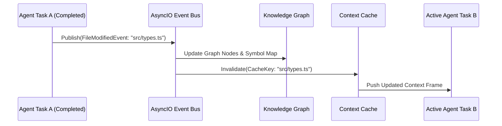

# 04. Knowledge & Context Engine Specification

A **Knowledge & Context Engine** felelős a projekt szemantikai struktúrájának tárolásáért, valamint a minimális és legrelevánsabb kontextus előállításáért az AI ágensek számára.

---

## 1. Knowledge Graph (Tudásgráf Architektúra)

A Tudásgráf egy in-memory vagy perzisztens gráfadatbázis (`NetworkX` vagy `Neo4j`), amely a szoftverarchitektúra entitásait és azok kapcsolatait képezi le.

```mermaid
erDiagram
    FILE ||--o{ CLASS : contains
    CLASS ||--o{ METHOD : defines
    METHOD ||--o{ CALLS : invokes
    FILE ||--o{ IMPORTS : depends_on
    METHOD ||--o{ TYPE : references
```

### 1.1. Csomópont Típusok (Node Types)
- `FileNode`: Elérési út, nyelv, utolsó módosítás időpontja, zárolási státusz.
- `ClassNode` / `InterfaceNode`: Osztály/Interfész név, láthatóság, öröklődés.
- `FunctionNode` / `MethodNode`: Függvény név, paraméterek, visszatérési típus.
- `VariableNode` / `FieldNode`: Konstansok, típusok, globális állapotok.

### 1.2. Élek Típusai (Edge Types)
- `CONTAINS`: Pl. `FileNode -> FunctionNode`
- `CALLS`: Pl. `FunctionNode A -> FunctionNode B`
- `DEPENDS_ON`: Pl. `FileNode A -> FileNode B` (import)
- `IMPLEMENTS` / `EXTENDS`: Pl. `ClassNode -> InterfaceNode`

---

## 2. Compressed Context Cache

Az AI ágensek nem kapják meg a teljes fájlokat vagy kódbázist. A **Context Cache** kizárólag tömörített felület- és típus-specifikációkat állít elő a feladat `read_set`-je és a Knowledge Graph alapján.

### 2.1. Tömörítési Stratégia (Skeleton Extraction)
- A törzskódot (függvény implementációt) eldobja a nem közvetlenül módosítandó fájlokból.
- Csak az interfész fejlécét (stubs / signatures), a típusdefiníciókat és a vonatkozó JSDoc/PyDoc kommenteket hagyja meg.

#### Példa Tömörített Kontextusra:
```typescript
// SKELETON CONTEXT FOR: src/services/PaymentProcessor.ts
// DO NOT EDIT THIS FILE. REFERENCED FOR INTERFACE COMPATIBILITY ONLY.

export interface PaymentRequest {
  transactionId: string;
  amount: number;
  currency: 'USD' | 'EUR';
}

export class PaymentProcessor {
  /** Processes credit card payments */
  public async processPayment(req: PaymentRequest): Promise<boolean>;
}
```

---

## 3. Event-Driven Cache Invalidation (Eseményvezérelt Érvénytelenítés)

Amikor egy feladat sikeresen lefut és módosít egy interfészt vagy fájlt, a régi kontextus használata szemantikai merge konfliktusokhoz és hibás kódgeneráláshoz vezetne.



### 3.1. Eseménybusz (Event Bus) Mechanizmus
- Az **Event Bus** `asyncio.Queue` vagy `Redis Pub/Sub` segítségével sugározza a módosításokat.
- Ha egy aktív vagy várakozó `Task B` függ egy módosított szimbólumtól (`Task A` által írt fájl), a `Task B` kontextusa azonnal frissítésre kerül, még mielőtt a feladatot az LLM megkapná.
