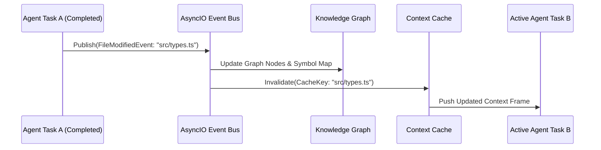

# 04. Knowledge & Context Engine Specification

A **Knowledge & Context Engine** is responsible for projekt szemantikai strukturajanak tarolasaert, as well as a minimalis es legrelevansabb kontextus eloallitasaert az AI agensek szamara.

---

## 1. Knowledge Graph (Tudasgraf Architektura)

A Tudasgraf egy in-memory vagy perzisztens grafadatbazis (`NetworkX` vagy `Neo4j`), amely a szoftverarchitektura entitasait es azok kapcsolatait kepezi le.

```mermaid
erDiagram
    FILE ||--o{ CLASS : contains
    CLASS ||--o{ METHOD : defines
    METHOD ||--o{ CALLS : invokes
    FILE ||--o{ IMPORTS : depends_on
    METHOD ||--o{ TYPE : references
```

### 1.1. Csomopont Tipusok (Node Types)
- `FileNode`: Eleresi ut, nyelv, utolso modositas idopontja, zarolasi statusz.
- `ClassNode` / `InterfaceNode`: Osztaly/Interfesz nev, lathatosag, oroklodes.
- `FunctionNode` / `MethodNode`: Fuggveny nev, parameterek, visszateresi tipus.
- `VariableNode` / `FieldNode`: Konstansok, tipusok, globalis allapotok.

### 1.2. Elek Tipusai (Edge Types)
- `CONTAINS`: Pl. `FileNode -> FunctionNode`
- `CALLS`: Pl. `FunctionNode A -> FunctionNode B`
- `DEPENDS_ON`: Pl. `FileNode A -> FileNode B` (import)
- `IMPLEMENTS` / `EXTENDS`: Pl. `ClassNode -> InterfaceNode`

---

## 2. Compressed Context Cache

Az AI agensek nem kapjak meg a teljes fajlokat vagy kodbazist. A **Context Cache** kizarolag tomoritett felulet- es tipus-specifikaciokat allit elo a feladat `read_set`-je and the Knowledge Graph based on.

### 2.1. Tomoritesi Strategia (Skeleton Extraction)
- A torzskodot (fuggveny implementaciot) eldobja a nem kozvetlenul modositando fajlokbol.
- Csak az interfesz fejlecet (stubs / signatures), a tipusdefiniciokat and the vonatkozo JSDoc/PyDoc kommenteket hagyja meg.

#### Pelda Tomoritett Kontextusra:
```typescript
// SKELETON CONTEXT FOR: src/services/PaymentProcessor.ts
// DO NOT EDIT THIS FILE. REFERENCED FOR INTERFACE COMPATIBILITY ONLY.

export interface PaymentRequest {
  transactionId: string;
  amount: number;
  currency: 'USD' | 'EUR';
}

export class PaymentProcessor {
  /** Processes credit card payments */
  public async processPayment(req: PaymentRequest): Promise<boolean>;
}
```

---

## 3. Event-Driven Cache Invalidation (Esemenyvezerelt Ervenytelenites)

Amikor egy feladat sikeresen lefut es modosit egy interfeszt vagy fajlt, a regi kontextus hasznalata szemantikai merge konfliktusokhoz es hibas kodgeneralashoz vezetne.



### 3.1. Esemenybusz (Event Bus) Mechanizmus
- Az **Event Bus** `asyncio.Queue` vagy `Redis Pub/Sub` segitsegevel sugarozza a modositasokat.
- Ha egy aktiv vagy varakozo `Task B` fugg egy modositott szimbolumtol (`Task A` altal irt fajl), a `Task B` kontextusa azonnal frissitesre kerul, meg mielott a feladatot az LLM megkapna.
