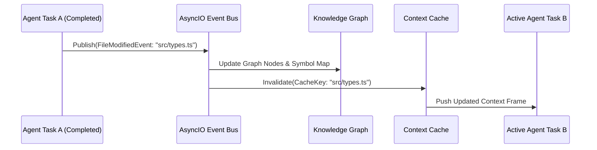

# 04. Knowledge & Context Engine Specification

The **Knowledge & Context Engine** is responsible for storing the semantic structure of the project and generating minimal, highly relevant context for AI agents.

---

## 1. Knowledge Graph Architecture

The Knowledge Graph is an in-memory or persistent graph database (`NetworkX` or `Neo4j`) that maps software architecture entities and their relationships.

```mermaid
erDiagram
    FILE ||--o{ CLASS : contains
    CLASS ||--o{ METHOD : defines
    METHOD ||--o{ CALLS : invokes
    FILE ||--o{ IMPORTS : depends_on
    METHOD ||--o{ TYPE : references
```

### 1.1. Node Types
- `FileNode`: File path, language, last modification timestamp, lock status.
- `ClassNode` / `InterfaceNode`: Class/Interface name, visibility, inheritance.
- `FunctionNode` / `MethodNode`: Function name, parameters, return type.
- `VariableNode` / `FieldNode`: Constants, types, global state.

### 1.2. Edge Types
- `CONTAINS`: E.g. `FileNode -> FunctionNode`
- `CALLS`: E.g. `FunctionNode A -> FunctionNode B`
- `DEPENDS_ON`: E.g. `FileNode A -> FileNode B` (import)
- `IMPLEMENTS` / `EXTENDS`: E.g. `ClassNode -> InterfaceNode`

---

## 2. Compressed Context Cache

AI agents do not receive whole raw files or the full codebase. The **Context Cache** generates compressed interface and type specifications exclusively based on the task `read_set` and the Knowledge Graph.

### 2.1. Compression Strategy (Skeleton Extraction)
- Drops function bodies (implementation logic) from files that are not directly targeted for modification.
- Preserves only interface headers (stubs / signatures), type definitions, and relevant JSDoc/PyDoc comments.

#### Example Compressed Context:
```typescript
// SKELETON CONTEXT FOR: src/services/PaymentProcessor.ts
// DO NOT EDIT THIS FILE. REFERENCED FOR INTERFACE COMPATIBILITY ONLY.

export interface PaymentRequest {
  transactionId: string;
  amount: number;
  currency: 'USD' | 'EUR';
}

export class PaymentProcessor {
  /** Processes credit card payments */
  public async processPayment(req: PaymentRequest): Promise<boolean>;
}
```

---

## 3. Event-Driven Cache Invalidation

When a task completes successfully and modifies an interface or file, using stale context would lead to semantic merge conflicts and buggy code generation.



### 3.1. Event Bus Mechanism
- The **Event Bus** broadcasts modifications using `asyncio.Queue` or `Redis Pub/Sub`.
- If an active or queued `Task B` depends on a modified symbol (modified by `Task A`), `Task B`'s context is refreshed immediately before the task prompt reaches the LLM.

