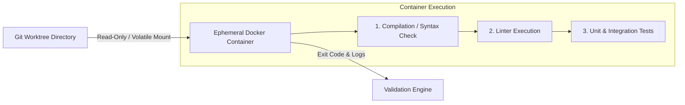
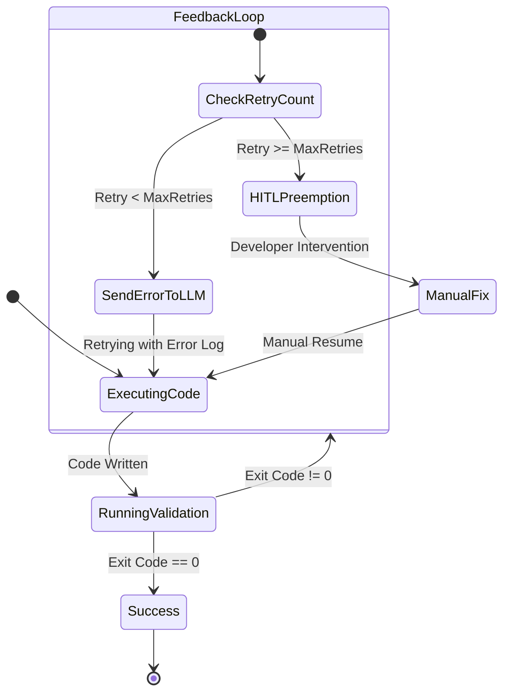

# 05. Execution & Validation Sandbox

Az **Execution & Validation Sandbox** gondoskodik a kod generalasanak biztonsagos izolaciojarol, a gyors fajlrendszer muveletekrol, as well as a szigoru konteneres validaciorol.

---

## 1. Host Environment: Git Worktrees Isolations

A fajlrendszer-muveletek gyorsasaga erdekeben az AI agensek a gazdagepen (Host OS) dolgoznak, azonban szigoruan **elkulonitett Git Worktree agakon**.

```bash
# Worktree letrehozasa egy specifikus feladathoz
git worktree add -b feature/TASK-102 .ai-os/worktrees/TASK-102 main
```

### Elonyok:
- Nem igenyel a teljes kodbazis lemasolasat (virtualis linkek es kozos `.git` objektum-adatbazis).
- Az agensek fuggetlenul tudnak fajlokat modositani es git commit-okat letrehozni.
- Barmely elhibazott vagy hibas feladat in case of a worktree nyomtalanul torolheto (`git worktree remove --force`).

---

## 2. Validation Pipeline: Ephemeral Docker Containers

Az AI altal generalt kod **soha nem futhat kozvetlenul a gazdagepen**, megelozve az esetleges kartekony scripteket vagy a gazdagep kornyezetenek beszennyezeset.



### 2.1. Eldobhato Kontener Konfiguracio
- **Alapertelmezett Image-ek**: `node:20-alpine`, `python:3.12-slim`, `maven:3.9-eclipse-temurin`
- **Halozati Izolacio**: `network_mode: "none"` (Az agens altal generalt kod nem kezdemenyezhet kimeno halozati kereseket a validacio soran, kiveve ha az tesztkovetelmeny).
- **Eroforras Korlatok**: Memoria limit (pl. 2GB), CPU limit (pl. 2 core), Timeout (pl. 60 sec).

---

## 3. Prompt Feedback Loop & HITL (Preemption Engine)

Ha a konteneres validacio hibaval zarul (nem 0 exit code), lep eletbe a **Prompt Feedback Loop** and the **Preemption Engine**.



### 3.1. Prompt Feedback Loop (Automata Hibajavitas)
Ha a tesztek elbuknak, az Orchestrator osszefoglalja a hiba kimenetet (Compiler / Linter / Pytest trace) es visszakuldi az agensnek:

```markdown
[VALIDATION FAILURE - TASK-102]
Your previous code change failed compilation in the ephemeral container.

Exit Code: 1
Error Log:
src/utils/math.ts:14:21 - error TS2345: Argument of type 'string' is not assignable to parameter of type 'number'.

Please fix the error above and provide the updated code snippet.
```

### 3.2. Preemption Engine (Human-in-the-Loop)
- Ha a feladat `retry_count` erteke eleri a kuszoberteket (pl. 3 sikertelen kiserlet):
1. A rendszer felfuggeszti (`BLOCKED`) az adott DAG agat.
2. Ertesitest kuld a **Glass Box UI** feluletre and the fejlesztonek.
3. A fejleszto atveheti a feladatot, modosithatja a kodot vagy a promptot, es manualisan visszakuldheti a feladatot a DAG hurkaba.
