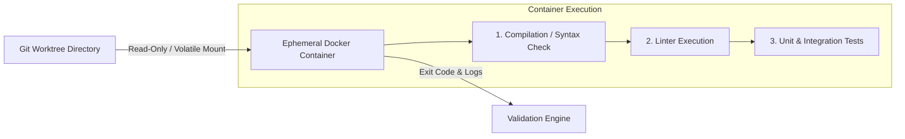
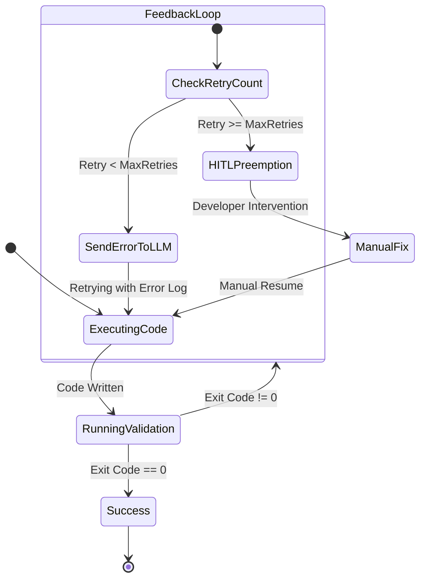

# 05. Execution & Validation Sandbox

The **Execution & Validation Sandbox** handles the safe isolation of code generation, fast filesystem operations, and strict containerized validation.

---

## 1. Host Environment: Git Worktrees Isolations

For filesystem operation speed, AI agents work directly on the host (Host OS), but strictly within **isolated Git Worktree branches**.

```bash
# Create a worktree for a specific task
git worktree add -b feature/TASK-102 .ai-os/worktrees/TASK-102 main
```

### Benefits:
- Does not require copying the entire codebase (virtual links and shared `.git` object database).
- Agents can modify files and create git commits independently.
- In case of any failed or buggy task, the worktree can be removed without trace (`git worktree remove --force`).

---

## 2. Validation Pipeline: Ephemeral Docker Containers

AI-generated code must **never execute directly on the host**, preventing potential malicious scripts or host environment contamination.



### 2.1. Ephemeral Container Configuration
- **Default Images**: `node:20-alpine`, `python:3.12-slim`, `maven:3.9-eclipse-temurin`
- **Network Isolation**: `network_mode: "none"` (Agent-generated code cannot initiate outbound network requests during validation unless explicitly required by tests).
- **Resource Limits**: Memory limit (e.g. 2GB), CPU limit (e.g. 2 cores), Timeout (e.g. 60 sec).

---

## 3. Prompt Feedback Loop & HITL (Preemption Engine)

If containerized validation ends with an error (non-zero exit code), the **Prompt Feedback Loop** and **Preemption Engine** take effect.



### 3.1. Prompt Feedback Loop (Automated Bug Fixing)
If tests fail, the Orchestrator summarizes the failure output (Compiler / Linter / Pytest trace) and sends it back to the agent:

```markdown
[VALIDATION FAILURE - TASK-102]
Your previous code change failed compilation in the ephemeral container.

Exit Code: 1
Error Log:
src/utils/math.ts:14:21 - error TS2345: Argument of type 'string' is not assignable to parameter of type 'number'.

Please fix the error above and provide the updated code snippet.
```

### 3.2. Preemption Engine (Human-in-the-Loop)
- If a task's `retry_count` reaches the threshold (e.g., 3 failed attempts):
1. The system suspends (`BLOCKED`) the affected DAG branch.
2. Sends a notification to the **Glass Box UI** interface and developer.
3. The developer can take over the task, modify code or prompt, and manually submit the task back into the DAG execution loop.

