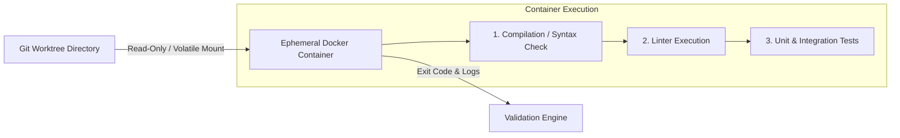
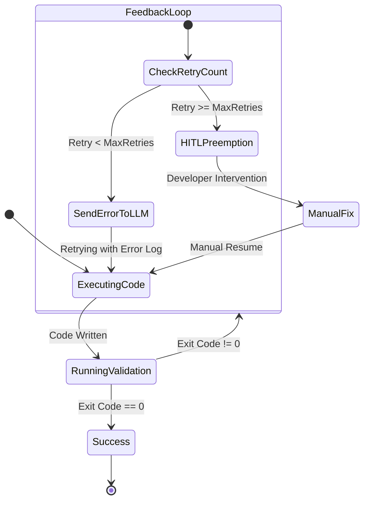

# 05. Execution & Validation Sandbox

Az **Execution & Validation Sandbox** gondoskodik a kód generálásának biztonságos izolációjáról, a gyors fájlrendszer műveletekről, valamint a szigorú konténeres validációról.

---

## 1. Host Environment: Git Worktrees Isolations

A fájlrendszer-műveletek gyorsasága érdekében az AI ágensek a gazdagépen (Host OS) dolgoznak, azonban szigorúan **elkülönített Git Worktree ágakon**.

```bash
# Worktree létrehozása egy specifikus feladathoz
git worktree add -b feature/TASK-102 .ai-os/worktrees/TASK-102 main
```

### Előnyök:
- Nem igényel a teljes kódbázis lemásolását (virtuális linkek és közös `.git` objektum-adatbázis).
- Az ágensek függetlenül tudnak fájlokat módosítani és git commit-okat létrehozni.
- Bármely elhibázott vagy hibás feladat esetén a worktree nyomtalanul törölhető (`git worktree remove --force`).

---

## 2. Validation Pipeline: Ephemeral Docker Containers

Az AI által generált kód **soha nem futhat közvetlenül a gazdagépen**, megelőzve az esetleges kártékony scripteket vagy a gazdagép környezetének beszennyezését.



### 2.1. Eldobható Konténer Konfiguráció
- **Alapértelmezett Image-ek**: `node:20-alpine`, `python:3.12-slim`, `maven:3.9-eclipse-temurin`
- **Hálózati Izoláció**: `network_mode: "none"` (Az ágens által generált kód nem kezdeményezhet kimenő hálózati kéréseket a validáció során, kivéve ha az tesztkövetelmény).
- **Erőforrás Korlátok**: Memória limit (pl. 2GB), CPU limit (pl. 2 core), Timeout (pl. 60 sec).

---

## 3. Prompt Feedback Loop & HITL (Preemption Engine)

Ha a konténeres validáció hibával zárul (nem 0 exit code), lép életbe a **Prompt Feedback Loop** és a **Preemption Engine**.



### 3.1. Prompt Feedback Loop (Automata Hibajavítás)
Ha a tesztek elbuknak, az Orchestrator összefoglalja a hiba kimenetet (Compiler / Linter / Pytest trace) és visszaküldi az ágensnek:

```markdown
[VALIDATION FAILURE - TASK-102]
Your previous code change failed compilation in the ephemeral container.

Exit Code: 1
Error Log:
src/utils/math.ts:14:21 - error TS2345: Argument of type 'string' is not assignable to parameter of type 'number'.

Please fix the error above and provide the updated code snippet.
```

### 3.2. Preemption Engine (Human-in-the-Loop)
- Ha a feladat `retry_count` értéke eléri a küszöbértéket (pl. 3 sikertelen kísérlet):
1. A rendszer felfüggeszti (`BLOCKED`) az adott DAG ágat.
2. Értesítést küld a **Glass Box UI** felületre és a fejlesztőnek.
3. A fejlesztő átveheti a feladatot, módosíthatja a kódot vagy a promptot, és manuálisan visszaküldheti a feladatot a DAG hurkába.
