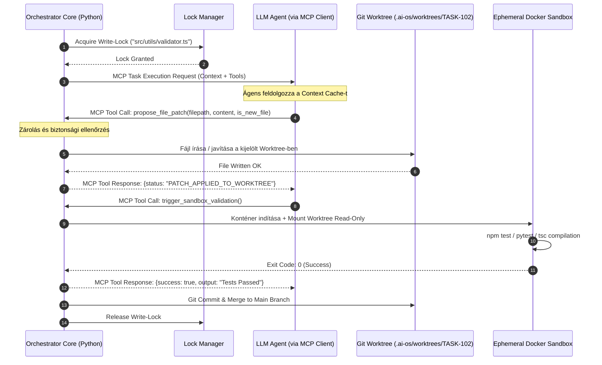

# 07. MCP Server & Orchestrator Engine Architecture

Ez a dokumentum az **AI-OS Orchestrator Kernel** és az **MCP (Model Context Protocol) Adapter & Server Engine** megvalósítási szintű specifikációja. Tartalmazza a determinisztikus rendszermag működését, az UML / Mermaid architektúra-diagramokat, a pontos JSON-RPC MCP parancssémákat és a fejlesztéshez szükséges Python kód-blueprintet.

---

## 1. Architektúra Koncepció: Kernel vs. AI Végrehajtó Magok

Az AI-OS működése a számítógépes operációs rendszerek (OS Kernel) mintájára épül:

- **Orchestrator Core (Ring 0 - OS Kernel)**: **100%-ig determinisztikus Python 3.12+ algoritmus** (`asyncio`). Felelős az állapotgépekért, a függőségi gráfokért (DAG), a fájlzárolásokért, az MCP szerver/kliens protokoll kommunikációért és a Git Worktree / Docker sandbox felügyeletéért. **0 token költségű**, nem téveszt, nem hallucinál.
- **AI Executing Cores (Ring 3 - User Space Processes)**: A felcserélhető LLM-ek (Claude, OpenAI, Gemini, DeepSeek). Kizárólag az Orchestrator által átadott korlátozott kontextussal és MCP eszközökkel dolgoznak.

```mermaid
graph TD
    User([Fejlesztő / Admin]) -->|1. High-level Task / Epic| OrchestratorKernel

    subgraph OrchestratorKernel [AI-OS Orchestrator Kernel (Deterministic Python Engine)]
        DAGPlanner[1. DAG Planner & Cycle Checker]
        LockManager[2. Granular Lock Manager]
        WorktreeMgr[3. Git Worktree Manager]
        MCPServer[4. Internal MCP Server & Router]
        SandboxMgr[5. Ephemeral Docker Sandbox Engine]
        
        DAGPlanner --> LockManager
        LockManager --> WorktreeMgr
        WorktreeMgr --> MCPServer
        MCPServer <--> SandboxMgr
    end

    subgraph ExecutingCores [AI Executing Cores (User Space LLMs)]
        ClaudeCore[Claude 3.5 Sonnet - High Risk]
        GeminiCore[Gemini 1.5 Flash - Low Risk]
        LocalCore[DeepSeek-R1 / Ollama - Offline]
    end

    MCPServer <-->|MCP JSON-RPC Protocol| ClaudeCore
    MCPServer <-->|MCP JSON-RPC Protocol| GeminiCore
    MCPServer <-->|MCP JSON-RPC Protocol| LocalCore
```

---

## 2. UML / Mermaid Szekvencia Diagram: Kódmódosítás Életciklusa

Az alábbi diagram szemlélteti, hogy egy ágens hogyan hoz létre vagy módosít egy fájlt a rendszerben anélkül, hogy közvetlen operációs rendszer hozzáférése lenne:



---

## 3. MCP Eszközök (Tools) Pontos JSON-RPC Sémája

Minden ágens kizárólag az alábbi 3 szabványos MCP eszközt hívhatja meg JSON-RPC üzenetekkel.

### 3.1. `propose_file_patch` (Kód létrehozása vagy módosítása)
Ezzel az eszközzel az ágens új fájlt hoz létre vagy egy meglévőt módosít a saját Git Worktree-jében.

#### JSON-RPC Kérés (LLM -> Orchestrator):
```json
{
  "jsonrpc": "2.0",
  "id": 42,
  "method": "tools/call",
  "params": {
    "name": "propose_file_patch",
    "arguments": {
      "filepath": "src/utils/validator.ts",
      "is_new_file": true,
      "content": "export function validateEmail(email: string): boolean {\n  const re = /^[^\\s@]+@[^\\s@]+\\.[^\\s@]+$/;\n  return re.test(email);\n}\n"
    }
  }
}
```

#### JSON-RPC Válasz (Orchestrator -> LLM):
```json
{
  "jsonrpc": "2.0",
  "id": 42,
  "result": {
    "content": [
      {
        "type": "text",
        "text": "SUCCESS: Patch applied to worktree isolated environment at .ai-os/worktrees/TASK-102/src/utils/validator.ts"
      }
    ],
    "isError": false
  }
}
```

---

### 3.2. `fetch_symbol_definition` (Szimbólum részletek kérése)
A kontextusablak kímélése érdekében az ágens ezzel kéri le egy olyan osztály/függvény teljes törzsét, amely nem volt benne az alap Context Cache-ben.

#### JSON-RPC Kérés:
```json
{
  "jsonrpc": "2.0",
  "id": 43,
  "method": "tools/call",
  "params": {
    "name": "fetch_symbol_definition",
    "arguments": {
      "symbol_id": "src/services/UserService.ts::UserRepository"
    }
  }
}
```

---

### 3.3. `trigger_sandbox_validation` (Konténeres validáció indítása)
Elindítja az eldobható Docker konténeres tesztet és visszacsatolja az eredménylogot.

#### JSON-RPC Kérés:
```json
{
  "jsonrpc": "2.0",
  "id": 44,
  "method": "tools/call",
  "params": {
    "name": "trigger_sandbox_validation",
    "arguments": {}
  }
}
```

#### JSON-RPC Válasz (Validation Passed):
```json
{
  "jsonrpc": "2.0",
  "id": 44,
  "result": {
    "content": [
      {
        "type": "text",
        "text": "VALIDATION PASSED\nExit Code: 0\nOutput:\n  tsc: 0 errors\n  pytest: 12 passed in 0.42s"
      }
    ],
    "isError": false
  }
}
```

---

## 4. Python Implementációs Blueprint (Orchestrator MCP Core)

Az alábbi kód bemutatja az Orchestrator MCP szerver és Git Worktree kezelőjének működőképes vázát:

```python
import asyncio
import os
import subprocess
from pathlib import Path
from typing import Dict, Any

class OrchestratorMCPBridge:
    def __init__(self, task_id: str, project_root: str):
        self.task_id = task_id
        self.project_root = Path(project_root)
        self.worktree_path = self.project_root / ".ai-os" / "worktrees" / task_id

    def setup_worktree(self, base_branch: str = "main"):
        """Létrehoz egy izolált Git Worktree-t a feladatnak determinisztikusan."""
        self.worktree_path.parent.mkdir(parents=True, exist_ok=True)
        cmd = [
            "git", "worktree", "add", "-b", f"feature/{self.task_id}",
            str(self.worktree_path), base_branch
        ]
        subprocess.run(cmd, cwd=self.project_root, check=True, capture_output=True)

    async def handle_propose_file_patch(self, args: Dict[str, Any]) -> Dict[str, Any]:
        """Kód írása / javítása a szeparált worktree-ben (NEM a fő kódbázisban!)."""
        rel_filepath = args.get("filepath")
        content = args.get("content")
        
        target_file = self.worktree_path / rel_filepath
        target_file.parent.mkdir(parents=True, exist_ok=True)
        
        # Fájl írása a Worktree-be
        with open(target_file, "w", encoding="utf-8") as f:
            f.write(content)
            
        return {
            "status": "SUCCESS",
            "message": f"File {rel_filepath} patched in isolated worktree {self.task_id}."
        }

    async def handle_trigger_sandbox_validation(self) -> Dict[str, Any]:
        """Docker container indítása a módosított worktree validálására."""
        # Docker run command read-only mount-tal
        cmd = [
            "docker", "run", "--rm",
            "-v", f"{self.worktree_path}:/app:ro",
            "--net", "none",  # Izolált hálózat
            "node:20-alpine", "npm", "test"
        ]
        
        proc = await asyncio.create_subprocess_exec(
            *cmd, stdout=asyncio.subprocess.PIPE, stderr=asyncio.subprocess.PIPE
        )
        stdout, stderr = await proc.communicate()
        
        return {
            "exit_code": proc.returncode,
            "success": proc.returncode == 0,
            "logs": stdout.decode() if proc.returncode == 0 else stderr.decode()
        }

    def cleanup_worktree(self):
        """Törli a worktree-t a sikeres merge után."""
        cmd = ["git", "worktree", "remove", "--force", str(self.worktree_path)]
        subprocess.run(cmd, cwd=self.project_root, capture_output=True)
```
