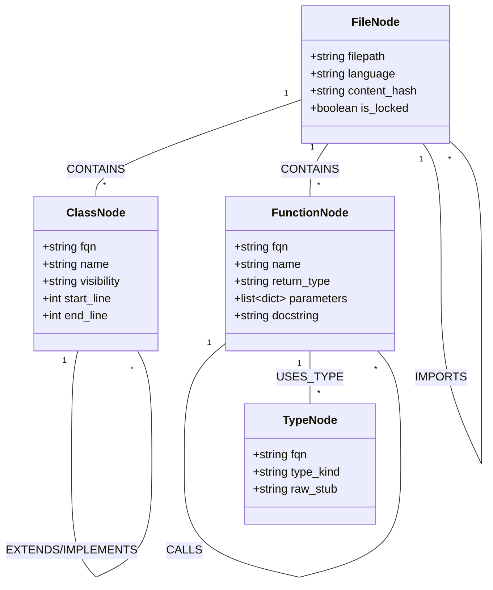
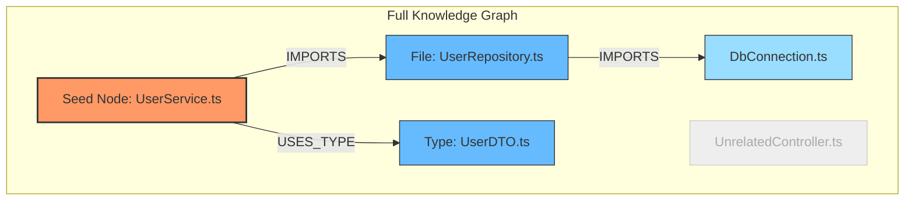

# 08. Knowledge Graph Schema & Subgraph Extraction Algorithms

Ez a dokumentum az **AI-OS Knowledge & Context Engine** mélyszintű specifikációja. Kidolgozza a Tudásgráf (Knowledge Graph) gráfadatbázis sémáját, a $k$-hop szomszédsági kinyerő algoritmust, a tömörített kódvázak (Skeleton Stubs) automatikus generálását, valamint a Python nyelven megírt teljes referencia-implementációt.

---

## 1. Tudásgráf Séma (Node & Edge Schema)

A Tudásgráf (`NetworkX` in-memory vagy `Neo4j` perzisztens adatbázisban) a forráskód entitásait és azok relációit tárolja determinisztikus Tree-sitter elemzés alapján.



### 1.1. Csomópontok (Nodes) Specifikációja

| Node Type | FQN (Fully Qualified Name) Példa | Kulcs Név-érték Pár Attribútumok |
| :--- | :--- | :--- |
| `FileNode` | `src/services/UserService.ts` | `filepath`, `language`, `hash`, `write_locked_by` |
| `ClassNode` | `src/services/UserService.ts::UserService` | `name`, `is_abstract`, `start_line`, `end_line` |
| `FunctionNode` | `src/services/UserService.ts::UserService.createUser` | `name`, `return_type`, `params`, `docstring` |
| `TypeNode` | `src/types/user.ts::UserDTO` | `name`, `kind` (`interface` / `enum` / `type`), `stub` |

### 1.2. Élek (Edges) Specifikációja

| Él Típusa (Edge) | Forrás (Source) ➔ Cél (Target) | Leírás / Attribútumok |
| :--- | :--- | :--- |
| `CONTAINS` | `FileNode ➔ ClassNode / FunctionNode` | Fájlstruktúra tagság |
| `IMPORTS` | `FileNode A ➔ FileNode B` | Statikus import függőség (`imported_symbols`) |
| `CALLS` | `FunctionNode A ➔ FunctionNode B` | Hívási gráf él (`call_line`, `is_async`) |
| `EXTENDS` | `ClassNode A ➔ ClassNode B` | Osztályöröklődés |
| `USES_TYPE` | `FunctionNode A ➔ TypeNode T` | Típusfüggőség a szignatúrában |

---

## 2. $k$-Hop Subgraph Extraction Algoritmus

Amikor egy AI ágens feladatot kap (pl. `target_files = ["src/services/UserService.ts"]`), a rendszer **nem küldi el a teljes kódbázist**. Ehelyett kiszámítja a célcsomópontok $k$-hop sugarú szomszédsági gráfját.



### Algoritmus Lépései:

1. **Magcsomópontok (Seed Nodes) beállítása**:
   - A feladat `write_set` és `read_set` fájljaihoz tartozó `FileNode`, `ClassNode` és `FunctionNode` elemek.
2. **Irányított Gráf-Bejárás ($k$-hop traversal)**:
   - $k=1$ sugarú bejárás a kimenő `IMPORTS`, `USES_TYPE`, `EXTENDS` éleken.
   - $k=1$ sugarú bejárás a bemenő `CALLS` éleken (kik hívják ezt a függvényt).
3. **Kód-váz kinyerése (Skeleton Extraction)**:
   - A $k$-hop grfban szereplő csomópontokból a rendszer kiszűri a függvénytörzseket (beépített implementáció), és csak a vázat (interfész szignatúra) tartja meg.

---

## 3. Skeleton Extractor (AST Kódtömörítés)

A **Skeleton Extractor** a kinyert subgrapban lévő fájlokból eldobja az algoritmusok belső kódját, 80-90%-os token-megtakarítást érve el:

### Eredeti Kód (100% Token):
```typescript
export class UserRepository {
  private db: DatabaseConnection;

  constructor(db: DatabaseConnection) {
    this.db = db;
    this.db.connect();
  }

  public async findById(id: string): Promise<User | null> {
    console.log("Fetching user from database with id:", id);
    const query = "SELECT * FROM users WHERE id = ?";
    const result = await this.db.query(query, [id]);
    if (!result || result.length === 0) return null;
    return new User(result[0]);
  }
}
```

### Generált Skeleton Stub (15% Token):
```typescript
// SKELETON STUB FOR DEPENDENCY: src/repositories/UserRepository.ts
// DO NOT MODIFY THIS FILE. FOR INTERFACE REFERENCE ONLY.

export class UserRepository {
  constructor(db: DatabaseConnection);
  public async findById(id: string): Promise<User | null>;
}
```

---

## 4. Python Implementációs Blueprint (NetworkX + Skeleton Generator)

Az alábbi Python modul tartalmazza a teljes tudásgráf építést, a $k$-hop subgraph kinyerést és a kontextus csomagolót:

```python
import networkx as nx
from typing import List, Set, Dict, Any

class KnowledgeEngine:
    def __init__(self):
        # Irányított multi-gráf a kódbázis entitásainak
        self.graph = nx.DiGraph()

    def add_file_node(self, filepath: str, language: str):
        self.graph.add_node(filepath, type="FileNode", language=language)

    def add_symbol_node(self, fqn: str, symbol_type: str, stub_code: str, file_path: str):
        self.graph.add_node(fqn, type=symbol_type, stub=stub_code, file=file_path)
        self.graph.add_edge(file_path, fqn, relation="CONTAINS")

    def add_dependency(self, source_fqn: str, target_fqn: str, relation_type: str):
        self.graph.add_edge(source_fqn, target_fqn, relation=relation_type)

    def extract_context_subgraph(self, target_files: List[str], max_hops: int = 2) -> str:
        """
        Kiszámítja a k-hop szomszédsági gráfot és előállítja a tömörített Context Cache-t.
        """
        extracted_nodes: Set[str] = set()

        for target_file in target_files:
            if target_file not in self.graph:
                continue
            
            # Ego graph kinyerése k-hop távolságra
            subgraph = nx.ego_graph(self.graph, target_file, radius=max_hops, undirected=False)
            extracted_nodes.update(subgraph.nodes())

        # Tömörített kontextus szöveg előállítása
        context_blocks: List[str] = []
        visited_files: Set[str] = set()

        for node_id in extracted_nodes:
            node_data = self.graph.nodes[node_id]
            node_type = node_data.get("type")

            if node_type == "FileNode":
                visited_files.add(node_id)
            elif "stub" in node_data and node_data.get("file") in visited_files:
                context_blocks.append(f"// Symbol: {node_id}\n{node_data['stub']}\n")

        header = f"=== COMPRESSED CONTEXT CACHE ({len(context_blocks)} SYMBOLS, k={max_hops}) ===\n"
        return header + "\n".join(context_blocks)

    def invalidate_file(self, filepath: str):
        """
        Eseményvezérelt érvénytelenítés: törli a fájlhoz tartozó szimbólumokat és éleket.
        """
        if filepath in self.graph:
            # Eltávolítjuk a fájl által tartalmazott szimbólumokat
            contained_nodes = [
                target for _, target, data in self.graph.out_edges(filepath, data=True)
                if data.get("relation") == "CONTAINS"
            ]
            for node in contained_nodes:
                self.graph.remove_node(node)
            self.graph.remove_node(filepath)
```
