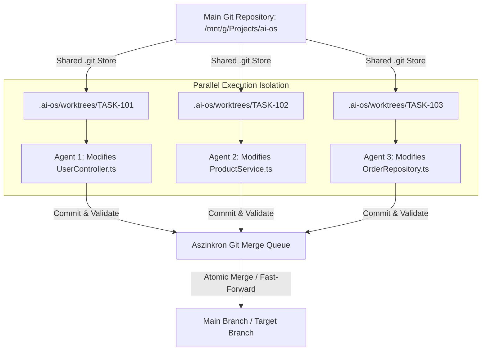
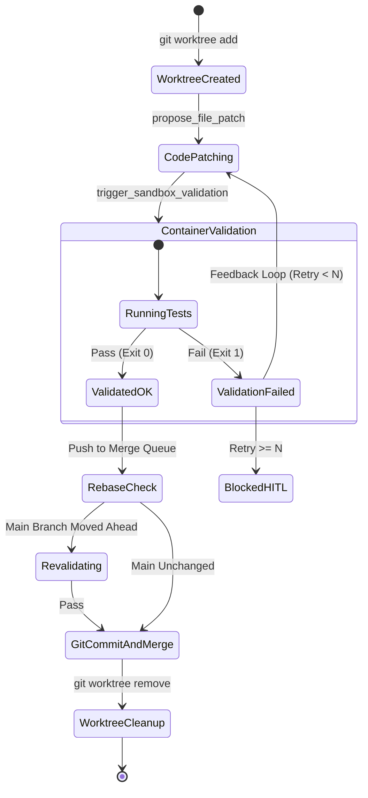

# 09. Git Worktree & Merge/Rebase Staging Engine Spec

Ez a dokumentum az **AI-OS Git Worktree & Merge Staging Engine** mélyszintű specifikációja. Kidolgozza a párhuzamos ágensek fájlrendszer-izolációját, a Git Worktree dinamikus életciklusát, az aszinkron Merge Queue működését, a Rebase/Pre-merge re-validációt, valamint az automata Git-konfliktus feloldást.

---

## 1. Architektúra és Izolációs Koncepció

Az AI-OS-ben **minden aktív ágens egy teljesen különálló Git Worktree mappában dolgozik**. A Worktree egy virtuális Git elágazás a gazdagép fájlrendszerén, amely megosztja a meglévő `.git` objektum-adatbázist, így **nem igényel tárhely-másolást** és ezredmásodpercek alatt létrejön.



---

## 2. A Git Worktree Életciklusa (Lifecycle States)

Minden feladat (Task) alatt a Worktree az alábbi állapot-átmeneteken megy keresztül:



---

## 3. Aszinkron Git Merge Queue & Rebase Staging Strategy

Amikor több ágens fut párhuzamosan (pl. `TASK-101` és `TASK-102`), előfordulhat, hogy `TASK-101` előbb fejezi be a munkát és módosítja a `main` ágat.

### A Staging Engine Rebase & Re-validation Szabálya:

1. **`TASK-101` befejezi a munkát**: Átmegy a teszteken ➔ beolvad a `main` ágba (`git merge --ff-only`).
2. **`TASK-102` befejezi a munkát**: Mielőtt a `main`-be olvadna, a Staging Engine észleli, hogy a `main` ág előrelépett!
3. **Automata Rebase & Újravalidáció**:
   - A Staging Engine végrehajt egy `git rebase main` parancsot a `TASK-102` worktree-jében.
   - **Újra-futtatja a Docker konténeres tesztet** a frissített kódállapoton.
   - Ha a teszt lefut, a `TASK-102` biztonságosan beolvad a `main` ágba.

---

## 4. Git Merge Konfliktus Kezelő Engine (Conflict Resolution)

Ha a Rebase során klasszikus Git merge konfliktus keletkezik (pl. `<<<<<<< HEAD` jelek a fájlban):

```mermaid
graph TD
    Conflict[Git Rebase Conflict Detected] --> ExtractMarkers[Conflict Marker & Diff Extractor]
    ExtractMarkers --> CreateConflictTask[Automata TASK-CONFLICT Generálás]
    CreateConflictTask --> AssignLLM[LLM Agent Assignment (High Risk)]
    AssignLLM -->|Fix Conflict & Commit| Revalidate[Docker Container Re-validation]
    Revalidate -->|Success| FinalMerge[Merge to Main]
```

### Konfliktus Feloldó Prompt Sablon (Automata):
```markdown
[GIT MERGE CONFLICT DETECTED]
A git merge conflict occurred while rebasing Task TASK-102 onto main branch.

Conflicting File: src/controllers/UserController.ts
Conflict Content:
<<<<<<< HEAD (Main Branch State)
export async function getUser(id: string): Promise<UserResponse> {
=======
export async function getUser(userId: string): Promise<User> {
>>>>>>> feature/TASK-102 (Agent Change)

Instructions:
Resolve the conflict above by unifying the function signature, keeping interface compatibility.
Use the `propose_file_patch` tool to save the resolved file.
```

---

## 5. Python Implementációs Blueprint (GitStagingEngine)

Az alábbi Python osztály kezeli a Worktree staging-et, a rebase felügyeletet és a biztonságos merge-et:

```python
import subprocess
import asyncio
from pathlib import Path
from typing import Dict, Any, Optional

class GitStagingEngine:
    def __init__(self, repo_root: str):
        self.repo_root = Path(repo_root)
        self.worktrees_dir = self.repo_root / ".ai-os" / "worktrees"
        self._merge_lock = asyncio.Lock()

    def create_worktree(self, task_id: str, base_branch: str = "main") -> Path:
        """Determinisztikus Git Worktree létrehozása."""
        wt_path = self.worktrees_dir / task_id
        branch_name = f"ai-os/{task_id}"
        
        cmd = ["git", "worktree", "add", "-b", branch_name, str(wt_path), base_branch]
        res = subprocess.run(cmd, cwd=self.repo_root, capture_output=True, text=True)
        if res.returncode != 0:
            raise RuntimeError(f"Git Worktree kreálás sikertelen: {res.stderr}")
        return wt_path

    async def stage_and_merge_task(self, task_id: str, commit_message: str, validator_callback) -> bool:
        """
        Zárolt és atomi Merge Queue folyamat: Rebase -> Re-validate -> Merge -> Cleanup
        """
        wt_path = self.worktrees_dir / task_id
        branch_name = f"ai-os/{task_id}"

        async with self._merge_lock:  # Garantálja, hogy egyszerre csak 1 feladat merge-el a main-be
            # 1. Git Commit a Worktree-ben
            subprocess.run(["git", "add", "."], cwd=wt_path, check=True)
            subprocess.run(["git", "commit", "-m", commit_message], cwd=wt_path, check=True)

            # 2. Rebase a legfrissebb main-re
            rebase_res = subprocess.run(["git", "rebase", "main"], cwd=wt_path, capture_output=True, text=True)
            if rebase_res.returncode != 0:
                # Merge konfliktus történt! Megállítjuk a rebase-t az automata feloldásig.
                subprocess.run(["git", "rebase", "--abort"], cwd=wt_path)
                return False

            # 3. Újravalidálás Docker konténerben a frissített rebase kódállapoton
            is_valid = await validator_callback(wt_path)
            if not is_valid:
                return False

            # 4. Biztonságos Merge a fő ágba (Fast-Forward)
            subprocess.run(["git", "checkout", "main"], cwd=self.repo_root, check=True)
            subprocess.run(["git", "merge", "--ff-only", branch_name], cwd=self.repo_root, check=True)

            # 5. Worktree és ideiglenes ág törlése
            self.cleanup_worktree(task_id, branch_name)
            return True

    def cleanup_worktree(self, task_id: str, branch_name: str):
        """Törli a használt worktree-t és ágat."""
        wt_path = self.worktrees_dir / task_id
        subprocess.run(["git", "worktree", "remove", "--force", str(wt_path)], cwd=self.repo_root, capture_output=True)
        subprocess.run(["git", "branch", "-D", branch_name], cwd=self.repo_root, capture_output=True)
```
