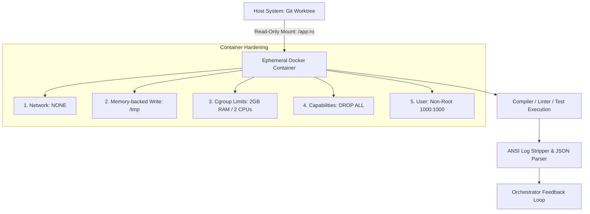
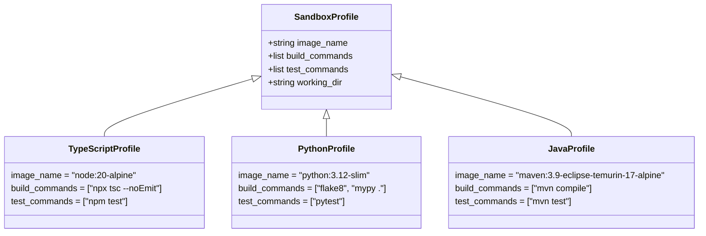

# 10. Ephemeral Container Sandbox & Security Spec

This document is the **AI-OS Execution & Validation Sandbox** melyszintu biztonsagi es kontener-specifikacioja. Kidolgozza az eldobhato (ephemeral) Docker/Podman konteneres izolaciot, a biztonsagi szabalyzatokat, a nyelvi profilmatrixot, az ansi-log strukturalast, as well as a Python referencia-implementaciot.

---

## 1. Biztonsagi es Izolacios Modell (Hardened Security)

Az AI altal generalt kod **potencialisan nem biztonsagos** (tartalmazhat hibas forditasi kodokat, vegtelen ciklusokat, felhos kornyezetbol kiszivargott API kulcsok kereseset vagy kartekony scripteket). Ezert a kod validacioja kizarolag szigoritott kontenerekben tortenhet.



### 1.1. Kontener Biztonsagi Profil (Security Constraints)

| Biztonsagi Korlat | Beallitas / Flag | Cel & Indoklas |
| :--- | :--- | :--- |
| **Halozati Izolacio** | `--net none` | Megakadalyozza, that the kod adatokat szivarogtasson ki az internetre. |
| **Fajlrendszer Vedelme** | `-v /worktree:/app:ro` | A gazdagep kodja **Read-Only** nezetben van felcsatolva. |
| **Ideiglenes Iras** | `--tmpfs /tmp:rw,noexec` | A kontener csak a RAM-ban levo ideiglenes taroloba irhat. |
| **Eroforras Korlatozas** | `--memory=2g --cpus=2.0` | Megakadalyozza a Denial of Service (DoS) es memoriatulcsordulasi tamadasokat. |
| **Idokorlat (Timeout)** | `max_execution_time = 60s` | Vegtelen ciklusba ragadt tesztek automata kilovese (`SIGKILL`). |
| **Jogosultsagok Megvonasa** | `--cap-drop=ALL --user 1000` | Megakadalyozza a kontenerbol valo kijutast (Container Escape). |

---

## 2. Nyelvi Profil Matrix (Language Profile Matrix)

Az Orchestrator a projekt nyelve based on valasztja ki a megfelelo pehelysulyu kontener image-et es tesztparancsot:



---

## 3. Log Strukturalas es Prompt Feedback Loop

A kontener terminal kimenete (stdout/stderr) gyakran tele van ANSI szinkodokkal es felesleges formazasi elemekkel. A rendszer ezt egy letisztult JSON strukturara alakitja a hibajavito LLM agens szamara.

### Raw ANSI Output ➔ Clean Markdown Feedback:

```python
# Raw output transzformacio JSON hiba-objektumma
{
  "status": "VALIDATION_FAILED",
  "exit_code": 1,
  "summary": "TypeScript compilation failed with 1 error.",
  "errors": [
    {
      "file": "src/utils/validator.ts",
      "line": 14,
      "column": 21,
      "rule": "TS2345",
      "message": "Argument of type 'string' is not assignable to parameter of type 'number'."
    }
  ]
}
```

---

## 4. Python Implementacios Blueprint (`EphemeralSandboxRunner`)

Az alabbi Python modul kezelje a Docker SDK segitsegevel az eldobhato kontenerek eletciklusat es biztonsagi beallitasait:

```python
import asyncio
import re
import docker
from typing import Dict, Any, Tuple

class EphemeralSandboxRunner:
    def __init__(self):
        # Docker client csatlakozas a gazdagep daemon-jahoz
        self.client = docker.from_env()

    async def run_validation(self, worktree_path: str, language: str) -> Tuple[bool, int, str]:
        """
        Biztonsagos konteneres tesztfuttatas eldobhato Docker kontenerben.
        """
        image_map = {
            "typescript": ("node:20-alpine", "npx tsc --noEmit && npm test"),
            "python": ("python:3.12-slim", "pip install -r requirements.txt && pytest"),
            "java": ("maven:3.9-eclipse-temurin-17-alpine", "mvn test"),
        }

        if language not in image_map:
            raise ValueError(f"Nem tamogatott nyelv a homokozoban: {language}")

        image, cmd = image_map[language]

        # Szigoritott kontener konfiguracio
        container_config = {
            "image": image,
            "command": f"sh -c '{cmd}'",
            "volumes": {
                worktree_path: {"bind": "/app", "mode": "ro"}  # READ-ONLY mount!
            },
            "working_dir": "/app",
            "network_mode": "none",  # Nincs halozati hozzaferes!
            "mem_limit": "2g",       # Maximum 2GB RAM
            "nano_cpus": 2000000000, # Maximum 2.0 CPU mag
            "tmpfs": {"/tmp": "rw,noexec,nosuid,size=256m"},
            "user": "1000:1000",     # Non-root felhasznalo
            "cap_drop": ["ALL"],     # Minden Linux capability torolve
            "detach": True
        }

        try:
            container = self.client.containers.run(**container_config)
            
            # Idokorlatos varakozas (Timeout max 60 masodperc)
            loop = asyncio.get_event_loop()
            result = await asyncio.wait_for(
                loop.run_in_executor(None, container.wait),
                timeout=60.0
            )

            exit_code = result.get("StatusCode", -1)
            raw_logs = container.logs(stdout=True, stderr=True).decode("utf-8")
            
            # Kontener azonnali takaritasa (Ephemeral cleanup)
            container.remove(force=True)
            
            clean_logs = self._strip_ansi_codes(raw_logs)
            return (exit_code == 0, exit_code, clean_logs)

        except asyncio.TimeoutError:
            container.remove(force=True)
            return (False, 124, "ERROR: Validation timed out after 60 seconds (Possible infinite loop).")
        except Exception as e:
            return (False, 500, f"SANDBOX RUNTIME ERROR: {str(e)}")

    def _strip_ansi_codes(self, text: str) -> str:
        """Eltavolitja az ANSI szinkodokat a letisztult LLM prompthoz."""
        ansi_escape = re.compile(r'\x1B(?:[@-Z\\-_]|\[[0-?]*[ -/]*[@-~])')
        return ansi_escape.sub('', text)
```
