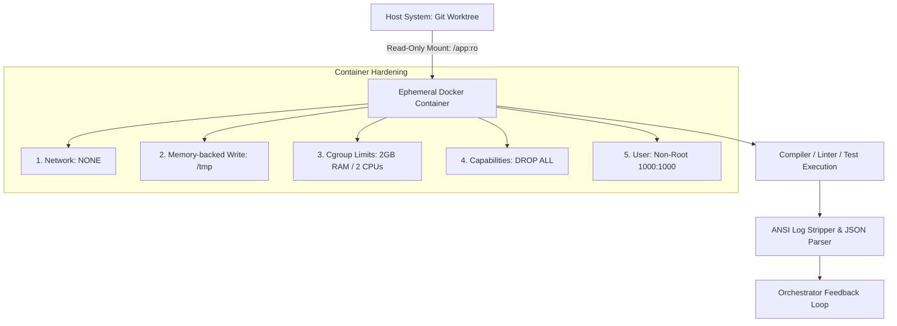
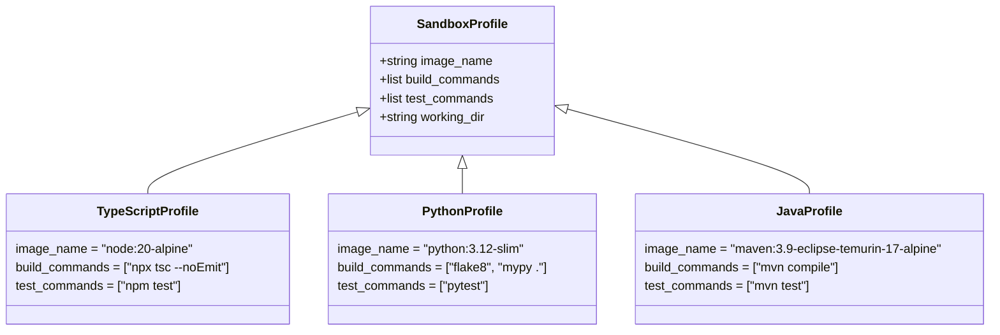

# 10. Ephemeral Container Sandbox & Security Spec

Ez a dokumentum az **AI-OS Execution & Validation Sandbox** mélyszintű biztonsági és konténer-specifikációja. Kidolgozza az eldobható (ephemeral) Docker/Podman konténeres izolációt, a biztonsági szabályzatokat, a nyelvi profilmátrixot, az ansi-log strukturálást, valamint a Python referencia-implementációt.

---

## 1. Biztonsági és Izolációs Modell (Hardened Security)

Az AI által generált kód **potenciálisan nem biztonságos** (tartalmazhat hibás fordítási kódokat, végtelen ciklusokat, felhős környezetből kiszivárgott API kulcsok keresését vagy kártékony scripteket). Ezért a kód validációja kizárólag szigorított konténerekben történhet.



### 1.1. Konténer Biztonsági Profil (Security Constraints)

| Biztonsági Korlát | Beállítás / Flag | Cél & Indoklás |
| :--- | :--- | :--- |
| **Hálózati Izoláció** | `--net none` | Megakadályozza, hogy a kód adatokat szivárogtasson ki az internetre. |
| **Fájlrendszer Védelme** | `-v /worktree:/app:ro` | A gazdagép kódja **Read-Only** nézetben van felcsatolva. |
| **Ideiglenes Írás** | `--tmpfs /tmp:rw,noexec` | A konténer csak a RAM-ban lévő ideiglenes tárolóba írhat. |
| **Erőforrás Korlátozás** | `--memory=2g --cpus=2.0` | Megakadályozza a Denial of Service (DoS) és memóriatúlcsordulási támadásokat. |
| **Időkorlát (Timeout)** | `max_execution_time = 60s` | Végtelen ciklusba ragadt tesztek automata kilövése (`SIGKILL`). |
| **Jogosultságok Megvonása** | `--cap-drop=ALL --user 1000` | Megakadályozza a konténerből való kijutást (Container Escape). |

---

## 2. Nyelvi Profil Mátrix (Language Profile Matrix)

Az Orchestrator a projekt nyelve alapján választja ki a megfelelő pehelysúlyú konténer image-et és tesztparancsot:



---

## 3. Log Strukturálás és Prompt Feedback Loop

A konténer terminál kimenete (stdout/stderr) gyakran tele van ANSI színkódokkal és felesleges formázási elemekkel. A rendszer ezt egy letisztult JSON strukturára alakítja a hibajavító LLM ágens számára.

### Raw ANSI Output ➔ Clean Markdown Feedback:

```python
# Raw output transzformáció JSON hiba-objektummá
{
  "status": "VALIDATION_FAILED",
  "exit_code": 1,
  "summary": "TypeScript compilation failed with 1 error.",
  "errors": [
    {
      "file": "src/utils/validator.ts",
      "line": 14,
      "column": 21,
      "rule": "TS2345",
      "message": "Argument of type 'string' is not assignable to parameter of type 'number'."
    }
  ]
}
```

---

## 4. Python Implementációs Blueprint (`EphemeralSandboxRunner`)

Az alábbi Python modul kezelje a Docker SDK segítségével az eldobható konténerek életciklusát és biztonsági beállításait:

```python
import asyncio
import re
import docker
from typing import Dict, Any, Tuple

class EphemeralSandboxRunner:
    def __init__(self):
        # Docker client csatlakozás a gazdagép daemon-jához
        self.client = docker.from_env()

    async def run_validation(self, worktree_path: str, language: str) -> Tuple[bool, int, str]:
        """
        Biztonságos konténeres tesztfuttatás eldobható Docker konténerben.
        """
        image_map = {
            "typescript": ("node:20-alpine", "npx tsc --noEmit && npm test"),
            "python": ("python:3.12-slim", "pip install -r requirements.txt && pytest"),
            "java": ("maven:3.9-eclipse-temurin-17-alpine", "mvn test"),
        }

        if language not in image_map:
            raise ValueError(f"Nem támogatott nyelv a homokozóban: {language}")

        image, cmd = image_map[language]

        # Szigorított konténer konfiguráció
        container_config = {
            "image": image,
            "command": f"sh -c '{cmd}'",
            "volumes": {
                worktree_path: {"bind": "/app", "mode": "ro"}  # READ-ONLY mount!
            },
            "working_dir": "/app",
            "network_mode": "none",  # Nincs hálózati hozzáférés!
            "mem_limit": "2g",       # Maximum 2GB RAM
            "nano_cpus": 2000000000, # Maximum 2.0 CPU mag
            "tmpfs": {"/tmp": "rw,noexec,nosuid,size=256m"},
            "user": "1000:1000",     # Non-root felhasználó
            "cap_drop": ["ALL"],     # Minden Linux capability törölve
            "detach": True
        }

        try:
            container = self.client.containers.run(**container_config)
            
            # Időkorlátos várakozás (Timeout max 60 másodperc)
            loop = asyncio.get_event_loop()
            result = await asyncio.wait_for(
                loop.run_in_executor(None, container.wait),
                timeout=60.0
            )

            exit_code = result.get("StatusCode", -1)
            raw_logs = container.logs(stdout=True, stderr=True).decode("utf-8")
            
            # Konténer azonnali takarítása (Ephemeral cleanup)
            container.remove(force=True)
            
            clean_logs = self._strip_ansi_codes(raw_logs)
            return (exit_code == 0, exit_code, clean_logs)

        except asyncio.TimeoutError:
            container.remove(force=True)
            return (False, 124, "ERROR: Validation timed out after 60 seconds (Possible infinite loop).")
        except Exception as e:
            return (False, 500, f"SANDBOX RUNTIME ERROR: {str(e)}")

    def _strip_ansi_codes(self, text: str) -> str:
        """Eltávolítja az ANSI színkódokat a letisztult LLM prompthoz."""
        ansi_escape = re.compile(r'\x1B(?:[@-Z\\-_]|\[[0-?]*[ -/]*[@-~])')
        return ansi_escape.sub('', text)
```
