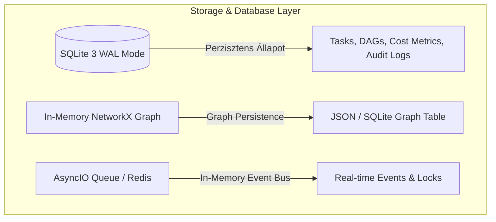
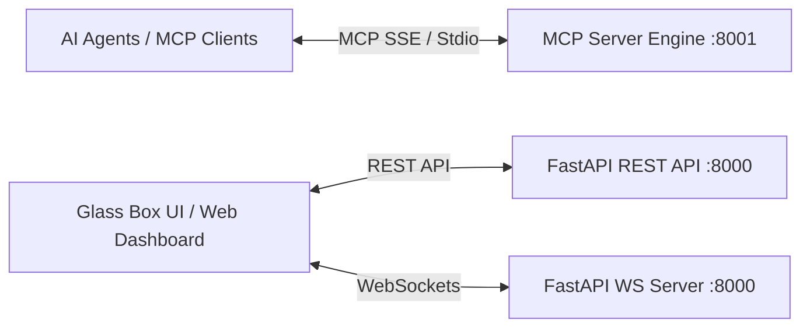

# 11. Orchestrator Tech Stack, Database & Deployment Spec

Ez a dokumentum az **AI-OS Orchestrator Engine és MCP Szerver** technológiai megvalósításának, adatbázis-architektúrájának, Docker konténerizációjának és HTTP/WebSocket/MCP API végpontjainak teljességgel részletezett specifikációja.

---

## 1. Programozási Nyelv és Könyvtár-Stakk

Az Orchestrator Core és az MCP Szerver nyelve: **Python 3.12+**.

### Miért Python?
1. **Aszinkron Concurrency**: Az `asyncio` lehetővé teszi több száz párhuzamos LLM hívás, háttérfolyamat (Git, Docker) és WebSocket kapcsolat nem-blokkoló kezelését alacsony memória-lábnyom mellett.
2. **Determinisztikus Elemző és Gráf Ökoszisztéma**: Nativ integráció a `py-tree-sitter` (AST parser), `networkx` (Tudásgráf) és `docker` (Python SDK) könyvtárakkal.
3. **Adatstruktúra Validáció**: `pydantic` v2 a szigorú típusellenőrzéshez és JSON sémák automatikus előállításához az LLM-ek számára.

---

## 2. Adatbázis és Tárolási Architektúra

Az AI-OS hibrid tárolási modellt alkalmaz a sebesség és az alacsony konfigurációs igény érdekében:



### 2.1. Elsődleges Relációs Adatbázis: **SQLite 3 (WAL Mode)**
- **Költséghatékony és Zero-Config**: Nincs szükség külső adatbázis-szerver telepítésére lokális használat esetén.
- **WAL (Write-Ahead Logging) Mód**: Magas párhuzamos olvasási és írási teljesítményt biztosít az aszinkron Python ORM-mel (`SQLAlchemy 2.0 async` / `aiosqlite`).
- **Tárolt Adatok**:
  - `epics` & `tasks`: DAG feladatok állapota (`PENDING`, `RUNNING`, `COMPLETED`, `FAILED`, `HITL`).
  - `lock_audits`: Aktív és előző fájl zárolások története.
  - `cost_metrics`: Használt tokenek száma modellcsoportonként és dollárköltség.

### 2.2. Tudásgráf Tároló: **NetworkX + SQLite Csomópont Tár**
- A Tudásgráf elsődlegesen a RAM-ban él (`NetworkX` irányított gráf) az ezredmásodperces $k$-hop lekérdezésekért.
- Rendszerindításkor és fájlmódosításkor a gráf szerkezete elmentődik az SQLite `graph_nodes` és `graph_edges` tábláiba.

---

## 3. Docker Konténerizáció és Telepítési Architektúra

Az Orchestrator rendszermag saját magát is futtathatja egy elszeparált Docker Compose környezetben:

```mermaid
graph TD
    subgraph Host OS / Developer Machine
        DockerSocket[/var/run/docker.sock/]
        WorkspaceDir[/mnt/g/Projects/ai-os]
    end

    subgraph Docker Compose Stack
        CoreContainer[Container 1: ai-os-core FastAPI + MCP Server]
        UIContainer[Container 2: ai-os-ui Glass Box React Frontend]
    end

    CoreContainer <-->|Volume Mount| DockerSocket
    CoreContainer <-->|Volume Mount| WorkspaceDir
    UIContainer <-->|HTTP / WS| CoreContainer
```

### `docker-compose.yml` Specifikáció:
```yaml
version: '3.8'

services:
  ai-os-core:
    build:
      context: .
      dockerfile: docker/Dockerfile.core
    container_name: ai-os-core
    ports:
      - "8000:8000"   # REST & WebSocket API
      - "8001:8001"   # MCP Server SSE Port
    volumes:
      - /var/run/docker.sock:/var/run/docker.sock  # Dinamikus konténer indítási jog
      - .:/workspace                                # Gazdagép kódbázis
    environment:
      - PYTHONUNBUFFERED=1
      - DATABASE_URL=sqlite+aiosqlite:////workspace/.ai-os/ai_os.db
      - ANTHROPIC_API_KEY=${ANTHROPIC_API_KEY}
      - OPENAI_API_KEY=${OPENAI_API_KEY}

  ai-os-ui:
    build:
      context: ./ui
      dockerfile: Dockerfile.ui
    container_name: ai-os-ui
    ports:
      - "3000:80"     # Glass Box Web Dashboard
    depends_on:
      - ai-os-core
```

---

## 4. Kommunikációs Protokollok és API Végpontok

Az Orchestrator háromféle interfészt biztosít: **MCP JSON-RPC**, **FastAPI REST API**, és **WebSockets**.



### 4.1. MCP Szerver Interfész (JSON-RPC 2.0 over SSE / Stdio)
- **SSE Végpont**: `GET /mcp/sse` (Server-Sent Events kapcsolat létesítése az LLM ágensekkel)
- **Message Végpont**: `POST /mcp/messages` (JSON-RPC tool hívások fogadása)

---

### 4.2. REST API Végpontok (`FastAPI`)

| Metódus | Végpont | Leírás / Funkció |
| :--- | :--- | :--- |
| `POST` | `/api/v1/epics` | Új felhasználói kérés felvétele és DAG tervezés elindítása. |
| `GET` | `/api/v1/dags/{dag_id}` | Az aktuális DAG gráf állapotának és feladat-nodejainak lekérése. |
| `GET` | `/api/v1/locks` | Aktív fájl zárolások (`Read-Set` / `Write-Set`) lekérése. |
| `GET` | `/api/v1/metrics/cost` | Összesített token-fogyasztás és dollárköltség lekérdezése. |
| `POST` | `/api/v1/tasks/{task_id}/retry` | **HITL**: Sikertelen feladat újraidítása egyedi fejlesztői instrukcióval. |
| `POST` | `/api/v1/tasks/{task_id}/resume` | **HITL**: Kézi kódmódosítás jóváhagyása és a feladat továbbengedése. |

---

### 4.3. WebSocket Végpont (Valós Idejű Események)
- **Végpont**: `WS /api/v1/ws/events`
- **Payload Példa (Task Állapotváltozás & Log Streaming)**:
```json
{
  "event_type": "TASK_STATE_CHANGED",
  "timestamp": "2026-08-02T10:35:00Z",
  "data": {
    "task_id": "TASK-102",
    "status": "RUNNING",
    "model_assigned": "claude-3-5-sonnet",
    "worktree": ".ai-os/worktrees/TASK-102",
    "active_locks": {
      "write": ["src/controllers/UserController.ts"]
    }
  }
}
```

---

## 5. Python Rendszermag Belépési Pont Blueprint (`main.py`)

```python
import asyncio
from fastapi import FastAPI, WebSocket, WebSocketDisconnect
from fastapi.middleware.cors import CORSMiddleware
from contextlib import asynccontextmanager

# In-memory WebSocket manager a Glass Box UI-hoz
class ConnectionManager:
    def __init__(self):
        self.active_connections: list[WebSocket] = []

    async def connect(self, websocket: WebSocket):
        await websocket.accept()
        self.active_connections.append(websocket)

    def disconnect(self, websocket: WebSocket):
        self.active_connections.remove(websocket)

    async def broadcast(self, message: dict):
        for connection in self.active_connections:
            await connection.send_json(message)

ws_manager = ConnectionManager()

@asynccontextmanager
async def lifespan(app: FastAPI):
    # Indítási architektúra: Adatbázis migrálás, Knowledge Engine betöltése
    print("[AI-OS Core] Starting Orchestrator Engine & SQLite Storage...")
    yield
    print("[AI-OS Core] Shutting down Orchestrator Engine...")

app = FastAPI(title="AI-OS Orchestrator Core API", version="1.0.0", lifespan=lifespan)

app.add_middleware(
    CORSMiddleware,
    allow_origins=["*"],
    allow_credentials=True,
    allow_methods=["*"],
    allow_headers=["*"],
)

@app.get("/api/v1/health")
async def health_check():
    return {"status": "HEALTHY", "engine": "AI-OS Python Core 3.12"}

@app.websocket("/api/v1/ws/events")
async def websocket_endpoint(websocket: WebSocket):
    await ws_manager.connect(websocket)
    try:
        while True:
            await websocket.receive_text()
    except WebSocketDisconnect:
        ws_manager.disconnect(websocket)
```
