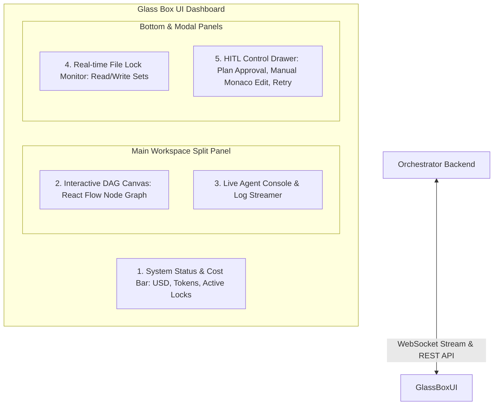
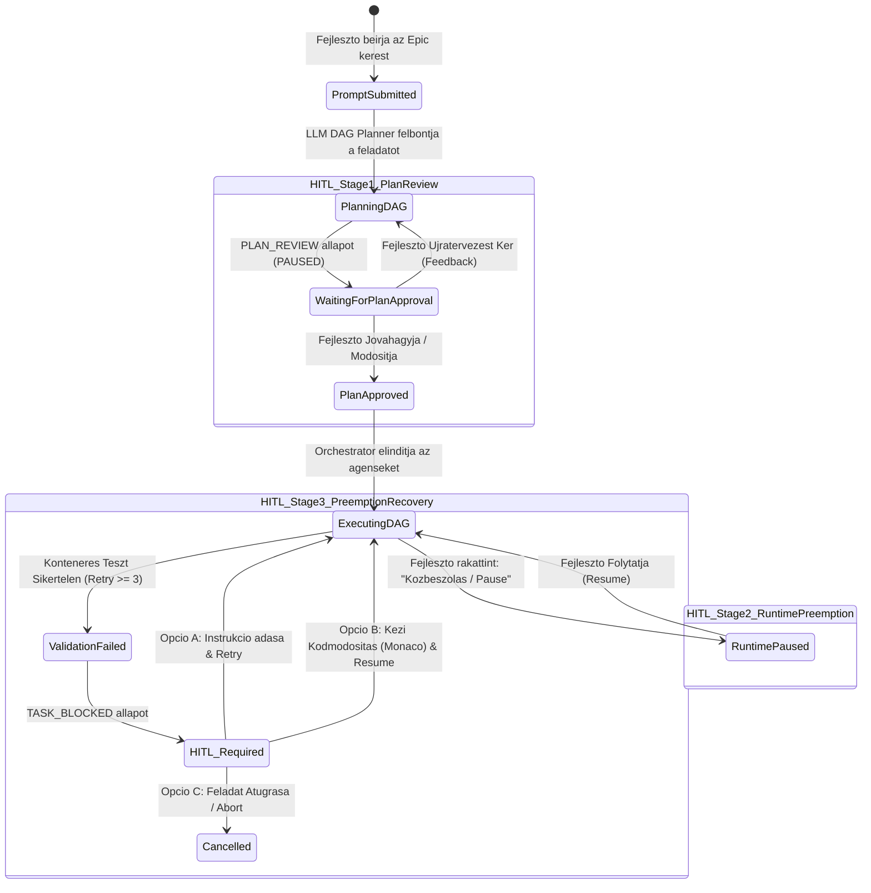

# 12. Glass Box UI & Interactive HITL Workflow Spec

This document is the **AI-OS Glass Box UI** and the **Human-In-The-Loop (HITL) Interaktiv Vezerlo felulet** teljesseggel reszletezett specifikacioja. Kidolgozza a valos ideju megfigyelhetoseget, az Epic/DAG feladatbontas fejlesztoi jovahagyasi lepeset (Planning Approval), a menet kozbeni kozbeszolast (Preemption), as well as a Monaco Editorral integralt kezi hibajavitasi munkafolyamatot.

---

## 1. Architektura es UI Komponens-Szerkezet

A Glass Box UI egy **React 18 + TypeScript + Vite + TailwindCSS + React Flow + Monaco Editor** alapu webes felulet, amely WebSockets-en keresztul kommunikal az Orchestrator FastAPI hatterrendszerevel.



---

## 2. A 3-Lepcsos Human-In-The-Loop (HITL) Munkafolyamat

Az AI-OS nem fut vakon. A fejleszto (Human) a teljes folyamat felett rendelkezo kontrollal bir az alabbi 3 szinten:



---

### 2.1. HITL Stage 1: DAG Tervezet Jovahagyas & Szerkesztes (Plan Review)

Amikor a fejleszto megad egy kerest (pl. *"Keszits JWT alapu autentikaciot"*):
1. A DAG Planner eloallitja a feladatbontas tervezetet (Epicek, Taskok, fuggosegek, varhato `write_set` fajlok).
2. **A rendszer automatikusan megall (`PLAN_REVIEW` allapot)**.
3. A Glass Box UI megjeleniti az interaktiv grafnezetet es feladattablazatot, ahol a fejleszto:
   - **Modosithatja a fuggosegi eleket** (drag-and-drop a React Flow vasznon).
   - **Szerkesztheti a feladatok adatait** (Cim, Leiras, Erintett fajlok, Kockazati szint).
   - **Uj feladatot adhat hozza vagy torolhet**.
   - Gombok: **"DAG Jovahagyasa & Inditas"** vagy **"Ujratervezes Kerese Instrukcioval"**.

---

### 2.2. HITL Stage 2: Menet Kozbeni Kozbeszolas (Runtime Preemption)

A fejleszto barmikor, a vegrehajtas kellos kozepen rakattinthat a **"PAUSE / KOZBESZOLAS"** gombra:
- Az Orchestrator befejezi a folyamatban levo atomi muveleteket, majd felfuggeszti a DAG utemezot.
- A fejleszto megvizsgalhatja az aktiv Git Worktree-ket, leallithat egy nem megfeleloen kodolo agenst, vagy modosithatja a zarolasokat.
- Gomb: **"Folytatas (Resume)"**.

---

### 2.3. HITL Stage 3: Hibas Feladat Feloldasa (Preemption Recovery)

Ha egy agens 3 egymast koveto alkalommal is elhasal a Docker konteneres validacion:
- A feladat **piros szegellyel `HITL_REQUIRED` allapotba kerul**.
- A jobb oldali felugro panelen (HITL Drawer) a fejlesztonek **3 cselekvesi lehetosege van**:

#### Opcio A: "Instrukcio adasa & Retry"
A fejleszto beir egy szoveges utmutatast az agensnek (pl. *"Ne hozz letre uj osztalyt, hasznald a meglevo HelperService.ts static metodusat!"*), es rakattint az **"Ujraprobalkozas"** gombra.

#### Opcio B: "Kezi Kodmodositas (Monaco Editor) & Resume"
A UI megnyitja a beepitett **Monaco Editor-t (VS Code szerkeszto elmeny)** kozvetlenul az agens Git Worktree-jeben levo fajlra!
- A fejleszto kijavitja a hibat a bongeszoben.
- Rakattint a **"Konteneres Teszt Futtatasa a UI-rol"** gombra.
- Ha a teszt zold, a **"Jovahagyas & Folytatas"** gombbal felulbiralja az agenst, and the DAG halad tovabb!

#### Opcio C: "Feladat Atugrasa (Skip) vagy Abort"
A feladat megjelolese atugrottkent, vagy a teljes Epic leallitasa.

---

## 3. Valos Ideju Megfigyelhetoseg (Glass Box Console)

A Glass Box UI garantalja, that the fejleszto minden pillanatban pontosan latja:

1. **Modell Kiosztas es Koltsegek**:
   - `TASK-101`: **Claude 3.5 Sonnet** (High Risk) ➔ *$0.042 / 14,200 tokens*
   - `TASK-102`: **Gemini 1.5 Flash** (Low Risk) ➔ *$0.001 / 8,100 tokens*
2. **Elo Log es Prompt Stream**:
   - Lasd az agensnek elkuldott tomoritett *Context Cache*-t.
   - Lasd az agens altal kibocsatott MCP Tool hivasokat (`propose_file_patch`).
   - Lasd a Git Worktree valos ideju `git diff` nezetet (piros/zold kodvaltozasok).
   - Lasd a Docker kontener tesztkimenetet (stdout/stderr).

---

## 4. UI Komponens Minta (React Flow DAG + HITL Panel Blueprint)

```tsx
import React, { useState } from 'react';
import ReactFlow, { Background, Controls } from 'reactflow';
import MonacoEditor from '@monaco-editor/react';

export const GlassBoxDashboard: React.FC = () => {
  const [dagState, setDagState] = useState<'PLAN_REVIEW' | 'RUNNING' | 'HITL_REQUIRED'>('PLAN_REVIEW');
  const [selectedTask, setSelectedTask] = useState<any>(null);

  return (
    <div className="flex h-screen w-screen bg-slate-950 text-slate-100 font-sans">
      {/* 1. KOLTSEG ES ALLAPOT SAV */}
      <header className="absolute top-0 left-0 right-0 h-14 bg-slate-900 border-b border-slate-800 flex items-center justify-between px-6 z-10">
        <div className="flex items-center space-x-4">
          <span className="text-xl font-bold text-cyan-400">AI-OS Glass Box</span>
          <span className={`px-2 py-1 rounded text-xs font-mono ${dagState === 'PLAN_REVIEW' ? 'bg-amber-500/20 text-amber-300' : 'bg-emerald-500/20 text-emerald-300'}`}>
            STATUS: {dagState}
          </span>
        </div>
        <div className="flex items-center space-x-6 text-sm font-mono">
          <div>Active Locks: <span className="text-cyan-400">3 Write / 5 Read</span></div>
          <div>Tokens: <span className="text-purple-400">124,500</span></div>
          <div>Est. Cost: <span className="text-emerald-400">$0.18</span></div>
        </div>
      </header>

      {/* 2. FO MUNKATERULET (DAG GRAPH + LIVE LOGS) */}
      <div className="flex flex-1 pt-14 w-full h-full">
        {/* Bal oldali DAG vaszon */}
        <div className="w-1/2 h-full border-r border-slate-800 relative">
          <ReactFlow nodes={[]} edges={[]}>
            <Background color="#334155" gap={16} />
            <Controls />
          </ReactFlow>
          
          {/* Stage 1: Plan Approval Overlay Banner */}
          {dagState === 'PLAN_REVIEW' && (
            <div className="absolute bottom-4 left-4 right-4 bg-amber-950/90 border border-amber-500 p-4 rounded-lg flex items-center justify-between z-20">
              <div>
                <h4 className="font-bold text-amber-200">DAG Plan Ready for Review</h4>
                <p className="text-xs text-amber-300/80">Review the generated tasks and dependencies above before starting execution.</p>
              </div>
              <button 
                onClick={() => setDagState('RUNNING')}
                className="px-4 py-2 bg-amber-500 hover:bg-amber-400 text-slate-950 font-bold text-sm rounded shadow">
                Approve & Execute DAG
              </button>
            </div>
          )}
        </div>

        {/* Jobb oldali Monaco / Live Log Streamer */}
        <div className="w-1/2 h-full flex flex-col bg-slate-900">
          <div className="h-10 bg-slate-950 px-4 flex items-center border-b border-slate-800 text-xs font-mono text-slate-400">
            LIVE AGENT LOGS & WORKTREE DIFF - TASK-102
          </div>
          <div className="flex-1">
            <MonacoEditor
              height="100%"
              theme="vs-dark"
              defaultLanguage="typescript"
              value={`// Live Worktree Diff for TASK-102\n+ export function validateEmail(email: string): boolean {\n+   return email.includes('@');\n+ }`}
              options={{ readOnly: dagState !== 'HITL_REQUIRED' }}
            />
          </div>
        </div>
      </div>
    </div>
  );
};
```
