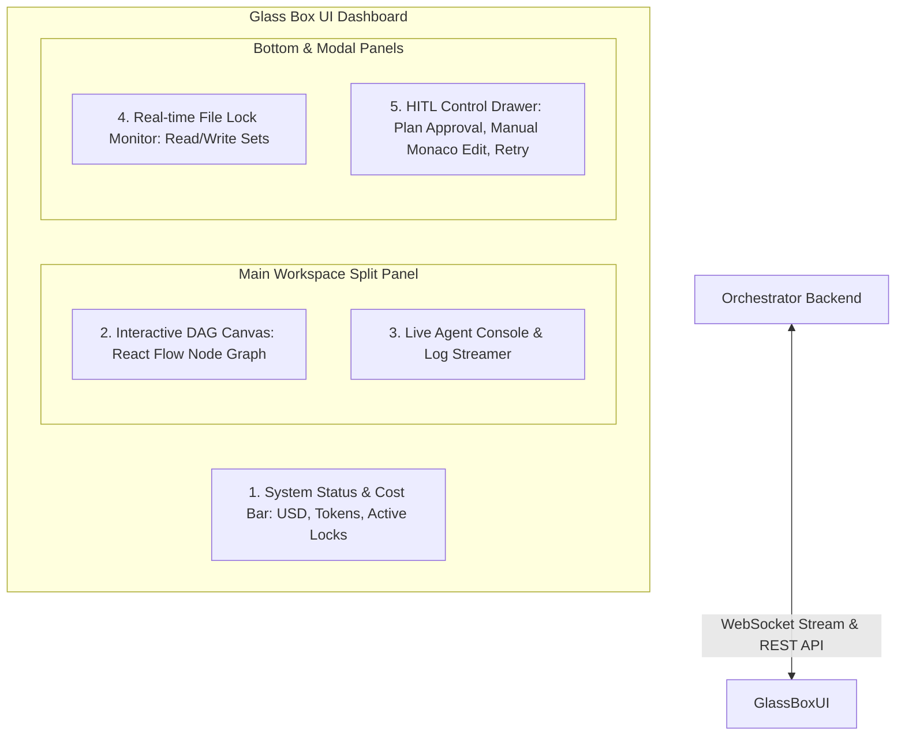

# 12. Glass Box UI & Interactive HITL Workflow Spec

Ez a dokumentum az **AI-OS Glass Box UI** és a **Human-In-The-Loop (HITL) Interaktív Vezérlő felület** teljességgel részletezett specifikációja. Kidolgozza a valós idejű megfigyelhetőséget, az Epic/DAG feladatbontás fejlesztői jóváhagyási lépését (Planning Approval), a menet közbeni közbeszólást (Preemption), valamint a Monaco Editorral integrált kézi hibajavítási munkafolyamatot.

---

## 1. Architektúra és UI Komponens-Szerkezet

A Glass Box UI egy **React 18 + TypeScript + Vite + TailwindCSS + React Flow + Monaco Editor** alapú webes felület, amely WebSockets-en keresztül kommunikál az Orchestrator FastAPI háttérrendszerével.



---

## 2. A 3-Lépcsős Human-In-The-Loop (HITL) Munkafolyamat

Az AI-OS nem fut vakon. A fejlesztő (Human) a teljes folyamat felett rendelkező kontrollal bír az alábbi 3 szinten:


---

### 2.1. HITL Stage 1: DAG Tervezet Jóváhagyás & Szerkesztés (Plan Review)

Amikor a fejlesztő megad egy kérést (pl. *"Készíts JWT alapú autentikációt"*):
1. A DAG Planner előállítja a feladatbontás tervezetét (Epicek, Taskok, függőségek, várható `write_set` fájlok).
2. **A rendszer automatikusan megáll (`PLAN_REVIEW` állapot)**.
3. A Glass Box UI megjeleníti az interaktív gráfnézetet és feladattáblázatot, ahol a fejlesztő:
   - **Módosíthatja a függőségi éleket** (drag-and-drop a React Flow vásznon).
   - **Szerkesztheti a feladatok adatait** (Cím, Leírás, Érintett fájlok, Kockázati szint).
   - **Új feladatot adhat hozzá vagy törölhet**.
   - Gombok: **"DAG Jóváhagyása & Indítás"** vagy **"Újratervezés Kérése Instrukcióval"**.

---

### 2.2. HITL Stage 2: Menet Közbeni Közbeszólás (Runtime Preemption)

A fejlesztő bármikor, a végrehajtás kellős közepén rákattinthat a **"PAUSE / KÖZBESZÓLÁS"** gombra:
- Az Orchestrator befejezi a folyamatban lévő atomi műveleteket, majd felfüggeszti a DAG ütemezőt.
- A fejlesztő megvizsgálhatja az aktív Git Worktree-ket, leállíthat egy nem megfelelően kódoló ágenst, vagy módosíthatja a zárolásokat.
- Gomb: **"Folytatás (Resume)"**.

---

### 2.3. HITL Stage 3: Hibás Feladat Feloldása (Preemption Recovery)

Ha egy ágens 3 egymást követő alkalommal is elhasal a Docker konténeres validáción:
- A feladat **piros szegéllyel `HITL_REQUIRED` állapotba kerül**.
- A jobb oldali felugró panelen (HITL Drawer) a fejlesztőnek **3 cselekvési lehetősége van**:

#### Opció A: "Instrukció adása & Retry"
A fejlesztő beír egy szöveges útmutatást az ágensnek (pl. *"Ne hozz létre új osztályt, használd a meglévő HelperService.ts static metódusát!"*), és rákattint az **"Újrapróbálkozás"** gombra.

#### Opció B: "Kézi Kódmódosítás (Monaco Editor) & Resume"
A UI megnyitja a beépített **Monaco Editor-t (VS Code szerkesztő élmény)** közvetlenül az ágens Git Worktree-jében lévő fájlra!
- A fejlesztő kijavítja a hibát a böngészőben.
- Rákattint a **"Konténeres Teszt Futtatása a UI-ról"** gombra.
- Ha a teszt zöld, a **"Jóváhagyás & Folytatás"** gombbal felülbírálja az ágenst, és a DAG halad tovább!

#### Opció C: "Feladat Átugrása (Skip) vagy Abort"
A feladat megjelölése átugrottként, vagy a teljes Epic leállítása.

---

## 3. Valós Idejű Megfigyelhetőség (Glass Box Console)

A Glass Box UI garantálja, hogy a fejlesztő minden pillanatban pontosan látja:

1. **Modell Kiosztás és Költségek**:
   - `TASK-101`: **Claude 3.5 Sonnet** (High Risk) ➔ *$0.042 / 14,200 tokens*
   - `TASK-102`: **Gemini 1.5 Flash** (Low Risk) ➔ *$0.001 / 8,100 tokens*
2. **Élő Log és Prompt Stream**:
   - Lásd az ágensnek elküldött tömörített *Context Cache*-t.
   - Lásd az ágens által kibocsátott MCP Tool hívásokat (`propose_file_patch`).
   - Lásd a Git Worktree valós idejű `git diff` nézetét (piros/zöld kódváltozások).
   - Lásd a Docker konténer tesztkimenetét (stdout/stderr).

---

## 4. UI Komponens Minta (React Flow DAG + HITL Panel Blueprint)

```tsx
import React, { useState } from 'react';
import ReactFlow, { Background, Controls } from 'reactflow';
import MonacoEditor from '@monaco-editor/react';

export const GlassBoxDashboard: React.FC = () => {
  const [dagState, setDagState] = useState<'PLAN_REVIEW' | 'RUNNING' | 'HITL_REQUIRED'>('PLAN_REVIEW');
  const [selectedTask, setSelectedTask] = useState<any>(null);

  return (
    <div className="flex h-screen w-screen bg-slate-950 text-slate-100 font-sans">
      {/* 1. KÖLTSÉG ÉS ÁLLAPOT SÁV */}
      <header className="absolute top-0 left-0 right-0 h-14 bg-slate-900 border-b border-slate-800 flex items-center justify-between px-6 z-10">
        <div className="flex items-center space-x-4">
          <span className="text-xl font-bold text-cyan-400">AI-OS Glass Box</span>
          <span className={`px-2 py-1 rounded text-xs font-mono ${dagState === 'PLAN_REVIEW' ? 'bg-amber-500/20 text-amber-300' : 'bg-emerald-500/20 text-emerald-300'}`}>
            STATUS: {dagState}
          </span>
        </div>
        <div className="flex items-center space-x-6 text-sm font-mono">
          <div>Active Locks: <span className="text-cyan-400">3 Write / 5 Read</span></div>
          <div>Tokens: <span className="text-purple-400">124,500</span></div>
          <div>Est. Cost: <span className="text-emerald-400">$0.18</span></div>
        </div>
      </header>

      {/* 2. FŐ MUNKATERÜLET (DAG GRAPH + LIVE LOGS) */}
      <div className="flex flex-1 pt-14 w-full h-full">
        {/* Bal oldali DAG vászon */}
        <div className="w-1/2 h-full border-r border-slate-800 relative">
          <ReactFlow nodes={[]} edges={[]}>
            <Background color="#334155" gap={16} />
            <Controls />
          </ReactFlow>
          
          {/* Stage 1: Plan Approval Overlay Banner */}
          {dagState === 'PLAN_REVIEW' && (
            <div className="absolute bottom-4 left-4 right-4 bg-amber-950/90 border border-amber-500 p-4 rounded-lg flex items-center justify-between z-20">
              <div>
                <h4 className="font-bold text-amber-200">DAG Plan Ready for Review</h4>
                <p className="text-xs text-amber-300/80">Review the generated tasks and dependencies above before starting execution.</p>
              </div>
              <button 
                onClick={() => setDagState('RUNNING')}
                className="px-4 py-2 bg-amber-500 hover:bg-amber-400 text-slate-950 font-bold text-sm rounded shadow">
                Approve & Execute DAG
              </button>
            </div>
          )}
        </div>

        {/* Jobb oldali Monaco / Live Log Streamer */}
        <div className="w-1/2 h-full flex flex-col bg-slate-900">
          <div className="h-10 bg-slate-950 px-4 flex items-center border-b border-slate-800 text-xs font-mono text-slate-400">
            LIVE AGENT LOGS & WORKTREE DIFF - TASK-102
          </div>
          <div className="flex-1">
            <MonacoEditor
              height="100%"
              theme="vs-dark"
              defaultLanguage="typescript"
              value={`// Live Worktree Diff for TASK-102\n+ export function validateEmail(email: string): boolean {\n+   return email.includes('@');\n+ }`}
              options={{ readOnly: dagState !== 'HITL_REQUIRED' }}
            />
          </div>
        </div>
      </div>
    </div>
  );
};
```
