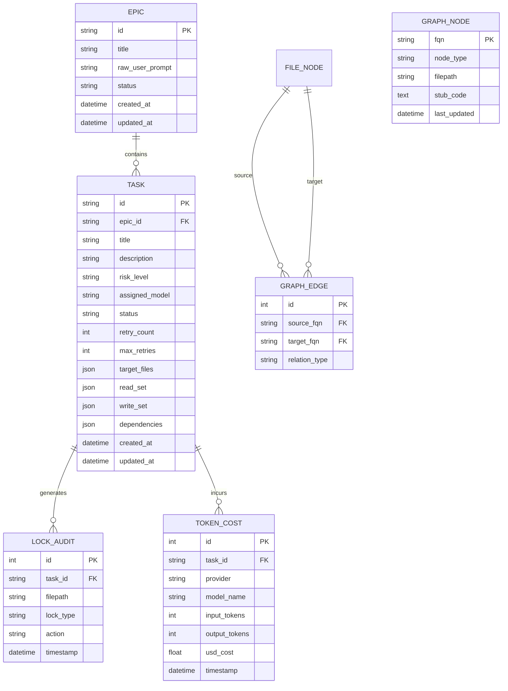

# 13. Database Schema & Async SQLAlchemy Models

This document is the complete specification for the **AI-OS Database Schema and SQLAlchemy 2.0 Async Models**. The database runs on SQLite 3 (WAL Mode) with async ORM support (`aiosqlite`).

---

## 1. ER Diagram (Entity-Relationship Diagram)



---

## 2. SQLAlchemy 2.0 Async Modellek Blueprint (`ai_os/core/db/models.py`)

```python
import datetime
from typing import List, Optional, Any
from sqlalchemy import String, Integer, Float, DateTime, ForeignKey, Text, JSON, func
from sqlalchemy.orm import DeclarativeBase, Mapped, mapped_column, relationship

class Base(DeclarativeBase):
    pass

class EpicModel(Base):
    __tablename__ = "epics"

    id: Mapped[str] = mapped_column(String(36), primary_key=True)
    title: Mapped[str] = mapped_column(String(255), nullable=False)
    raw_user_prompt: Mapped[str] = mapped_column(Text, nullable=False)
    status: Mapped[str] = mapped_column(String(32), default="PLAN_REVIEW")  # PLAN_REVIEW, RUNNING, COMPLETED, FAILED, PAUSED
    created_at: Mapped[datetime.datetime] = mapped_column(DateTime, server_default=func.now())
    updated_at: Mapped[datetime.datetime] = mapped_column(DateTime, server_default=func.now(), onupdate=func.now())

    tasks: Mapped[List["TaskModel"]] = relationship("TaskModel", back_populates="epic", cascade="all, delete-orphan")


class TaskModel(Base):
    __tablename__ = "tasks"

    id: Mapped[str] = mapped_column(String(64), primary_key=True)  # e.g., TASK-101
    epic_id: Mapped[str] = mapped_column(ForeignKey("epics.id"), nullable=False)
    title: Mapped[str] = mapped_column(String(255), nullable=False)
    description: Mapped[str] = mapped_column(Text, nullable=False)
    risk_level: Mapped[str] = mapped_column(String(16), default="LOW")  # LOW, MEDIUM, HIGH, CRITICAL
    assigned_model: Mapped[Optional[str]] = mapped_column(String(64), nullable=True)
    status: Mapped[str] = mapped_column(String(32), default="PENDING")  # PENDING, READY, RUNNING, COMPLETED, FAILED, HITL_REQUIRED
    
    retry_count: Mapped[int] = mapped_column(Integer, default=0)
    max_retries: Mapped[int] = mapped_column(Integer, default=3)

    target_files: Mapped[Any] = mapped_column(JSON, default=list)  # ["src/controllers/UserController.ts"]
    read_set: Mapped[Any] = mapped_column(JSON, default=list)      # ["src/types/user.ts"]
    write_set: Mapped[Any] = mapped_column(JSON, default=list)     # ["src/controllers/UserController.ts"]
    dependencies: Mapped[Any] = mapped_column(JSON, default=list)  # ["TASK-100"]

    created_at: Mapped[datetime.datetime] = mapped_column(DateTime, server_default=func.now())
    updated_at: Mapped[datetime.datetime] = mapped_column(DateTime, server_default=func.now(), onupdate=func.now())

    epic: Mapped["EpicModel"] = relationship("EpicModel", back_populates="tasks")
    lock_audits: Mapped[List["LockAuditModel"]] = relationship("LockAuditModel", back_populates="task")
    token_costs: Mapped[List["TokenCostModel"]] = relationship("TokenCostModel", back_populates="task")


class LockAuditModel(Base):
    __tablename__ = "lock_audits"

    id: Mapped[int] = mapped_column(Integer, primary_key=True, autoincrement=True)
    task_id: Mapped[str] = mapped_column(ForeignKey("tasks.id"), nullable=False)
    filepath: Mapped[str] = mapped_column(String(512), nullable=False)
    lock_type: Mapped[str] = mapped_column(String(16), nullable=False)  # READ, WRITE
    action: Mapped[str] = mapped_column(String(16), nullable=False)     # ACQUIRE, RELEASE
    timestamp: Mapped[datetime.datetime] = mapped_column(DateTime, server_default=func.now())

    task: Mapped["TaskModel"] = relationship("TaskModel", back_populates="lock_audits")


class TokenCostModel(Base):
    __tablename__ = "token_costs"

    id: Mapped[int] = mapped_column(Integer, primary_key=True, autoincrement=True)
    task_id: Mapped[str] = mapped_column(ForeignKey("tasks.id"), nullable=False)
    provider: Mapped[str] = mapped_column(String(32), nullable=False)     # anthropic, openai, gemini, local
    model_name: Mapped[str] = mapped_column(String(64), nullable=False)   # claude-3-5-sonnet
    input_tokens: Mapped[int] = mapped_column(Integer, default=0)
    output_tokens: Mapped[int] = mapped_column(Integer, default=0)
    usd_cost: Mapped[float] = mapped_column(Float, default=0.0)
    timestamp: Mapped[datetime.datetime] = mapped_column(DateTime, server_default=func.now())

    task: Mapped["TaskModel"] = relationship("TaskModel", back_populates="token_costs")


class GraphNodeModel(Base):
    __tablename__ = "graph_nodes"

    fqn: Mapped[str] = mapped_column(String(512), primary_key=True)  # e.g., src/user.ts::User
    node_type: Mapped[str] = mapped_column(String(32), nullable=False)  # FileNode, ClassNode, FunctionNode, TypeNode
    filepath: Mapped[str] = mapped_column(String(512), nullable=False)
    stub_code: Mapped[Optional[str]] = mapped_column(Text, nullable=True)
    last_updated: Mapped[datetime.datetime] = mapped_column(DateTime, server_default=func.now(), onupdate=func.now())


class GraphEdgeModel(Base):
    __tablename__ = "graph_edges"

    id: Mapped[int] = mapped_column(Integer, primary_key=True, autoincrement=True)
    source_fqn: Mapped[str] = mapped_column(String(512), nullable=False, index=True)
    target_fqn: Mapped[str] = mapped_column(String(512), nullable=False, index=True)
    relation_type: Mapped[str] = mapped_column(String(32), nullable=False)  # CONTAINS, IMPORTS, CALLS, USES_TYPE
```
