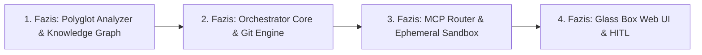

# 16. AI-OS MVP Development Roadmap & Testing Plan

This document is the **AI-OS 4-Fazisu Fejlesztesi Utemtervenek (MVP Roadmap)** es Tesztelesi Strategiajanak reszletes specifikacioja.

---

## 🗺️ Merfoldko Matrix (Phase Overview)

---

## 📌 1. Fazis: Determinisztikus Alapok (Polyglot Analyzer & Knowledge Graph)

> **Fokusz**: AI tokenek elegetese nelkuli kodbazis-ertelmezes, szimbolum kinyeres es kontextus-tomorites.

### Megvalositando Modulok:
- **`ai_os/analyzer/tree_sitter_engine.py`**:
  - Tree-sitter parserek beallitasa (JavaScript/TypeScript, Python, Java, HTML, CSS, SQL).
  - Szimbolumok (osztalyok, fuggvenyek, tipusok) kinyerese kezdo/zaro sorszamokkal.
- **`ai_os/analyzer/call_graph_builder.py`**:
  - Fajlok kozotti statikus `IMPORTS` es fuggveny-szintu `CALLS` fuggosegi graf epites.
- **`ai_os/knowledge/graph_engine.py`**:
  - `NetworkX` iranyitott multi-graf inicializalasa.
  - $k$-hop szomszedsagi bejarasi algoritmus ($k=2$).
- **`ai_os/knowledge/skeleton_extractor.py`**:
  - Fuggvenytorzsek kiejtese, vazlatos interfesz stub-ok generalasa.

### 🧪 1. Fazis Tesztelesi Kriteriumok (Acceptance Tests):
- [x] Egy 100 fajlbol allo mintaprojekt Tree-sitter beolvasasa kevesebb mint 1 masodperc alatt.
- [x] A $k$-hop subgraph kinyero 80-90%-os token-megtakaritast er el a nyers fajlokhoz kepest.

---

## 📌 2. Fazis: Rendszermag, Zarolas es Git Izolacio (Orchestrator Core & Git Engine)

> **Fokusz**: Parhuzamos feladat-vegrehajtas, adatkonfliktus-mentesseg es adatbazis perzisztencia.

### Megvalositando Modulok:
- **`ai_os/core/lock_manager.py`**:
  - Aszinkron `LockManager` megirasa (`read_set` megosztott zarolas, `write_set` kizarolagos zarolas).
- **`ai_os/core/staging.py`**:
  - `GitStagingEngine` megirasa (izolalt Worktree mappak krealasa `.ai-os/worktrees/TASK-ID`, `git merge-tree`, rebase staging).
- **`ai_os/core/db/`**:
  - SQLite 3 (WAL Mode) adatbazis kapcsolat (`aiosqlite` + SQLAlchemy 2.0 Async).
  - `EpicModel`, `TaskModel`, `LockAuditModel`, `TokenCostModel` migralasa.
- **`ai_os/core/planner.py`**:
  - DAG topologiai sorrendezes (`networkx.topological_sort`) es ciklusdetektalas.

### 🧪 2. Fazis Tesztelesi Kriteriumok:
- [x] Ket diszjunkt feladat (`Task A` es `Task B`) egyideju lefutasa kulon Worktree-ben merge konfliktus nelkul.
- [x] Ket azonos fajlt modositani kivano feladat in case of a Lock Manager sorba rendezi a vegrehajtast.

---

## 📌 3. Fazis: MCP Engine & Eldobhato Homokozo (MCP Router & Ephemeral Sandbox)

> **Fokusz**: AI modellek biztonsagos integracioja es automata konteneres teszteles.

### Megvalositando Modulok:
- **`ai_os/mcp/protocol_router.py`**:
  - Kockazat- es koltsegalapu modellvalasztasi matrix (`LOW` ➔ Gemini Flash, `HIGH` ➔ Claude Sonnet).
- **`ai_os/mcp/adapters/`**:
  - DUAL-AUTH tamogatas: API Key VAGY Native Web/OAuth Session Transport (Anthropic, OpenAI ChatGPT Plus, Google Gemini Free Tier, OpenRouter, Ollama).
- **`ai_os/sandbox/container_runner.py`**:
  - `EphemeralSandboxRunner` megirasa Docker SDK-val (`--net none`, `-v /worktree:/app:ro`, 2GB RAM limit).
- **`ai_os/sandbox/log_parser.py`**:
  - ANSI terminal kodok letisztitasa es JSON feedback formazas az LLM szamara.

### 🧪 3. Fazis Tesztelesi Kriteriumok:
- [x] Az agens altal generalt kod nem tud kimeno halozati kerest inditani a kontenerbol.
- [x] Hibas kod in case of a kontener hibauzenete based on az agens 2. probalkozasra kijavitja a hibat.

---

## 📌 4. Fazis: Glass Box Web UI es HITL Integracio (Vezerlo Felulet & HITL)

> **Fokusz**: Valos ideju fejlesztoi atlathatosag es interaktiv jovahagyasi munkafolyamat.

### Megvalositando Modulok:
- **`ai_os/main.py` & `ws_manager`**:
  - FastAPI REST API vegpontok es WebSocket szerver az elo log- es allapot-kozvetiteshez (`/api/v1/ws/events`).
- **`ui/src/components/DagCanvas.tsx`**:
  - React Flow interaktiv DAG feladat-graf vizualizacio.
- **`ui/src/components/HitlDrawer.tsx`**:
  - **Stage 1 Plan Review**: A DAG vegrehajtas automatikus megallitasa `PLAN_REVIEW` allapotban a fejleszto jovahagyasaig.
  - **Stage 2 Runtime Preemption**: "Pause / Kozbeszolas" gomb.
  - **Stage 3 Monaco Editor**: Beepitett VS Code kod-szerkeszto a feluleten a sikertelen tesztek kezi javitasahoz es felulbiralasahoz.

### 🧪 4. Fazis Tesztelesi Kriteriumok:
- [x] Uj Epic inditasakor a felulet megallitja a folyamatot, amig a fejleszto rakattint az "Approve & Execute DAG" gombra.
- [x] Manualis kodmodositas utan a UI-rol futtatott teszt sikere in case of a DAG automatikusan folytatodik.
