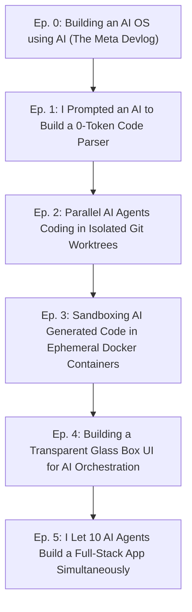

# 17. Open-Source Launch & "Vibe Coding" YouTube Strategy

Ez a dokumentum az **AI-OS Open-Source YouTube Videó-Sorozatának** frissített, "Faceless / Vibe Coding Devlog" formátumú forgatókönyve.

---

## 🎧 A Videó Stílus és Koncepció (Faceless Vibe Coding Devlog)

* **Nyelv**: **Angol (English)** – a nemzetközi fejlesztői közösség és a magasabb elérés érdekében.
* **Formátum**: **Faceless (Arc nélküli)**, esztétikus képernyőfelvételekkel, letisztult terminal/IDE vizuális elemekkel.
* **Módszertan**: **Vibe Coding / Prompt Engineering** – Nem manuálisan gépeljük a kódot karakterről karakterre, hanem az AI-OS-t magát is AI segítségével, magas szintű architektúra-promptolással építjük fel!
* **Vágási Stílus**: Dinamikus vágások, gyorsított (1.5x - 2x) kódgenerálási idővonalak, lo-fi / synthwave háttérzene, tiszta angol hangalámondás (voiceover).

---

## 🎬 Epizód Terv & Vágási Forgatókönyv (English Episodes)

---

### 🎥 Episode 0: *I'm Building an AI Operating System to Replace Copilot (And Vibe Coding It)*
- **Format**: 3-5 minute high-energy devlog intro.
- **Hook**:  
  *"Current AI coding assistants are flawed. They waste tokens, hallucinate across files, and run unsandboxed scripts. So I decided to build AI-OS: a deterministic Python kernel that manages parallel AI execution. And the best part? I'm vibe coding the entire open-source system using AI."*
- **Visuals**:
  - Fast montage of terminal execution, dark-mode VS Code, Docker containers starting up.
  - Lo-fi / Synthwave background beat.
  - Showing the GitHub repository and architecture diagrams (`docs/`).
- **Call to Action**: *"Star the repo on GitHub and join the build!"*

---

### 🎥 Episode 1: *Vibe Coding a Zero-Token Code Parser with Tree-sitter & NetworkX*
- **Format**: 5-7 minute devlog montage.
- **Story**:
  - Explain the concept: Why agents shouldn't read raw files (Knowledge Before Generation).
  - **Montage**: Prompting the AI to generate the `py-tree-sitter` AST parser and `NetworkX` graph engine.
  - Show the fast-forwarded prompt & response cycles.
  - **The Magic Moment**: Running `python main.py` on a real repository and showing a 90% compressed Skeleton Stub printed to the terminal.

---

### 🎥 Episode 2: *How I Made 3 AI Agents Code Simultaneously Without Git Conflicts*
- **Format**: 5-7 minute devlog montage.
- **Story**:
  - The problem: How to keep parallel LLMs from overwriting each other's code.
  - **Montage**: Implementing Git Worktrees (`.ai-os/worktrees/`) and the async Lock Manager.
  - Show split-screen terminals where 3 agents work in isolated directories simultaneously.
  - Show the automatic `git rebase` and merge queue resolving a conflict.

---

### 🎥 Episode 3: *Sandboxing Untrusted AI Code in Ephemeral Docker Containers*
- **Format**: 5-7 minute devlog montage.
- **Story**:
  - Security risk: What if an AI generates malicious code or an infinite loop?
  - **Montage**: Setting up hardened Docker containers (`--net none`, `:ro` volume mounts, RAM limits).
  - **The Demo**: Deliberately prompting an agent to write broken code -> Docker container catches the error -> Automated Prompt Feedback Loop fixes it on attempt 2!

---

### 🎥 Episode 4: *Designing a Glass Box Web UI with React Flow & Monaco Editor*
- **Format**: 6-8 minute devlog montage.
- **Story**:
  - Visualizing the transparent "Glass Box" operation and 3-stage Human-in-the-Loop workflow.
  - **Montage**: Building the React Flow DAG canvas and integrating Monaco Editor for manual code overrides.
  - Show the UI pausing execution at `PLAN_REVIEW` state for developer approval.

---

### 🎥 Episode 5: *I Let 10 AI Agents Build a Full-Stack App Simultaneously*
- **Format**: 8-10 minute finale showcase.
- **Story**:
  - Giving AI-OS a massive single prompt (e.g., "Build a full-stack SaaS application").
  - Watching the Glass Box UI stream real-time logs, execute 10 DAG tasks in parallel across Docker containers, and auto-merge the code.
  - Launching the finished web application live on video!

---

## 🎛️ Vágási & Képernyőfelvételi Beállítások (Production Guidelines)

1. **Audio / Hangalámondás**:
   - Angol nyelvű hangalámondás (Voiceover) felvétele utólag (Voiceover over Montage), vagy AI szinkronhang (pl. ElevenLabs) finomhangolva.
   - Háttérzene: Copyright-free Lo-fi Chill Beats / Synthwave (pl. Epidemic Sound / Streambeats).
2. **Képernyőfelvétel (OBS Studio)**:
   - 1080p60 vagy 4K felbontás.
   - Sötét téma (Tokyo Night / Catppuccin Macchiato).
   - Növelt font méret az IDE-ben (18px), zoom effektusok a fontos kódrészletekre.
3. **Vágóprogram (DaVinci Resolve / Premiere Pro)**:
   - Gyorsított kódgenerálás (1.5x - 2x speedup).
   - Finom átmenetek (Smooth Pan & Zoom, Sound Effects / Swoosh hangok a terminál kimeneteknél).
