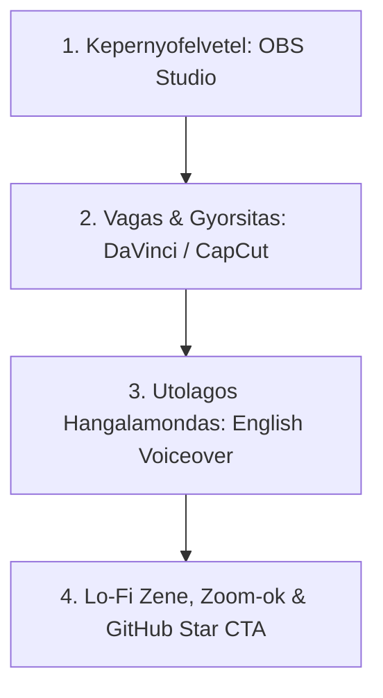

# 18. YouTube Video Production & Editing Playbook

This document is the **AI-OS "Vibe Coding" YouTube Video-Sorozatanak** gyakorlati gyartasi, felveteli es vagasi utmutatoja.

---

## 🎬 Gyartasi Munkafolyamat (4 Lepeses Video Keszites)

Nem kell eloben beszelned kodolas kozben, es nem kell kamerat/arcot hasznalnod. A video-keszites 4 egyszeru, utolagosan osszeallithato lepesbol all:

---

### 1. Lepes: Kepernyofelvetel (OBS Studio)
- **Mit rogzits?**: Az elsodleges monitorodat (VS Code / Cursor, terminal, Docker, browser).
- **Format**: 1080p60 vagy 4K (60 FPS az akadasmentes gorgetesert).
- **Hogyan dolgozz?**: Csak vegezd a dolgodat! Ird a promptokat az AI-nak, teszteld a modult, inditsd el a Docker-t. **Nem kell beszelned felvetel kozben**, csak csinald a kodolast.

---

### 2. Lepes: Vagas & Gyorsitas (DaVinci Resolve / CapCut / Premiere)
- **Felesleg kivagasa**: Vagd ki a statikus varakozasokat es ures perceket.
- **Gyorsitas (Speedup)**: A kodgeneralast, a terminal kiirasokat and the valaszokat gyorsitsd fel **1.5x - 3x-os sebessegre**.
- **Rakozelites (Screen Zoom)**: Amikor a terminalban lefut a teszt (zold Pytest pipa) vagy elindul a Docker kontener, kozelits ra (zoom effect) arra a sarokra, hogy telefonos kepernyon is szuper jol olvashato legyen.

---

### 3. Lepes: Utolagos Angol Hangalamondas (Scripted Voiceover)
- Nezd vegig az osszevagott porgos videodat, es utolag mondd ra a mikrofonba a rovid angol magyarazatot:
  > *"So first, I prompted Claude to generate our Tree-sitter AST parser... As you can see, it automatically extracts all class definitions and functions... Next, we run our test inside Docker..."*
- **Elonye**: Nem kell izgulnod, felolvashatod a sajat vazlatodat, es garantaltan letisztult angol kiejtest tudsz rogziteni.

---

### 4. Lepes: Hatterzene & Hangeffektek (Lo-Fi & SFX)
- Valassz egy halk, copyright-free **Lo-Fi / Synthwave hatterzenet** (pl. Epidemic Sound / Streambeats).
- Hasznalj finom hangeffekteket (pl. "whoosh" vagy "pop") ablakvaltasoknal es sikeres tesztfuttatasoknal.

---

## 📐 A Nyero Video Szerkezete (3-5 Perc Total)

| Idosav | Szakasz Nev | Vizualis Tartalom | Narracio / Hang |
| :--- | :--- | :--- | :--- |
| **0:00 - 0:15** | **The Hook (A Kampo)** | A mukodo vegeredmeny 5 mp-es demoja (zold teszt, porgo UI). | *"In this video, I vibe-coded a zero-token AST code parser for our open-source AI OS. Here's how it works."* |
| **0:15 - 0:45** | **Architecture Diagram** | Mermaid / Excalidraw rajz a rendszer operation. | Rovid magyarazat az elmeleti hatterrol. |
| **0:45 - 3:30** | **Vibe Coding Montage** | Gyorsitott kepernyofelvetel (1.5x-3x) rakozelitesekkel (zoom). | Folyamatos angol voiceover lo-fi zenevel. |
| **3:30 - 4:00** | **Outro & Call to Action** | GitHub repository megnyitasa a bongeszoben. | *"The repo is 100% open source. Check out the link in the description, leave a star on GitHub!"* |

---

## ⚙️ Ajanlott Technikai Beallitasok

- **VS Code Tema**: Tokyo Night / Catppuccin Macchiato / One Dark Pro (Sotet kontrasztos tema).
- **Betumeret (Font Size)**: 18px az IDE-ben and the terminalban is.
- **Vagoszoftver**: CapCut Desktop (nagyon egyszeru & ingyenes) vagy DaVinci Resolve (professzionalis).
- **Hangeffektek**: FreeSFX / Pixabay Audio (Pop, Whoosh, Soft Click).
