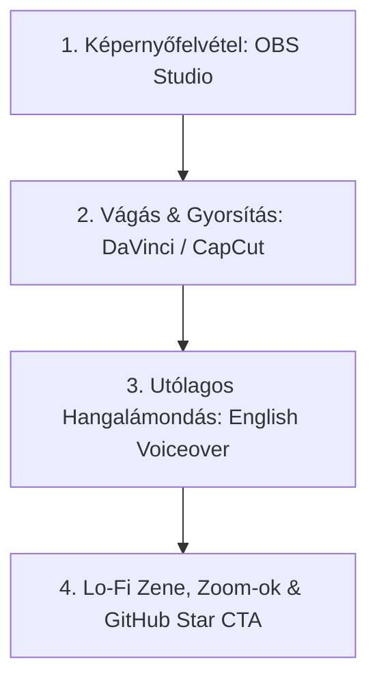

# 18. YouTube Video Production & Editing Playbook

Ez a dokumentum az **AI-OS "Vibe Coding" YouTube Videó-Sorozatának** gyakorlati gyártási, felvételi és vágási útmutatója.

---

## 🎬 Gyártási Munkafolyamat (4 Lépéses Videó Készítés)

Nem kell élőben beszélned kódolás közben, és nem kell kamerát/arcot használnod. A videó-készítés 4 egyszerű, utólagosan összeállítható lépésből áll:

---

### 1. Lépés: Képernyőfelvétel (OBS Studio)
- **Mit rögzíts?**: Az elsődleges monitorodat (VS Code / Cursor, terminál, Docker, browser).
- **Format**: 1080p60 vagy 4K (60 FPS az akadásmentes görgetésért).
- **Hogyan dolgozz?**: Csak végezd a dolgodat! Írd a promptokat az AI-nak, teszteld a modult, indítsd el a Docker-t. **Nem kell beszélned felvétel közben**, csak csináld a kódolást.

---

### 2. Lépés: Vágás & Gyorsítás (DaVinci Resolve / CapCut / Premiere)
- **Felesleg kivágása**: Vágd ki a statikus várakozásokat és üres perceket.
- **Gyorsítás (Speedup)**: A kódgenerálást, a terminál kiírásokat és a válaszokat gyorsítsd fel **1.5x - 3x-os sebességre**.
- **Ráközelítés (Screen Zoom)**: Amikor a terminálban lefut a teszt (zöld Pytest pipa) vagy elindul a Docker konténer, közelíts rá (zoom effect) arra a sarokra, hogy telefonos képernyőn is szuper jól olvasható legyen.

---

### 3. Lépés: Utólagos Angol Hangalámondás (Scripted Voiceover)
- Nézd végig az összevágott pörgős videódat, és utólag mondd rá a mikrofonba a rövid angol magyarázatot:
  > *"So first, I prompted Claude to generate our Tree-sitter AST parser... As you can see, it automatically extracts all class definitions and functions... Next, we run our test inside Docker..."*
- **Előnye**: Nem kell izgulnod, felolvashatod a saját vázlatodat, és garantáltan letisztult angol kiejtést tudsz rögzíteni.

---

### 4. Lépés: Háttérzene & Hangeffektek (Lo-Fi & SFX)
- Válassz egy halk, copyright-free **Lo-Fi / Synthwave háttérzenét** (pl. Epidemic Sound / Streambeats).
- Használj finom hangeffekteket (pl. "whoosh" vagy "pop") ablakváltásoknál és sikeres tesztfuttatásoknál.

---

## 📐 A Nyerő Videó Szerkezete (3-5 Perc Total)

| Idősáv | Szakasz Név | Vizuális Tartalom | Narráció / Hang |
| :--- | :--- | :--- | :--- |
| **0:00 - 0:15** | **The Hook (A Kampó)** | A működő végeredmény 5 mp-es demója (zöld teszt, pörgő UI). | *"In this video, I vibe-coded a zero-token AST code parser for our open-source AI OS. Here's how it works."* |
| **0:15 - 0:45** | **Architecture Diagram** | Mermaid / Excalidraw rajz a rendszer működéséről. | Rövid magyarázat az elméleti háttérről. |
| **0:45 - 3:30** | **Vibe Coding Montage** | Gyorsított képernyőfelvétel (1.5x-3x) ráközelítésekkel (zoom). | Folyamatos angol voiceover lo-fi zenével. |
| **3:30 - 4:00** | **Outro & Call to Action** | GitHub repository megnyitása a böngészőben. | *"The repo is 100% open source. Check out the link in the description, leave a star on GitHub!"* |

---

## ⚙️ Ajánlott Technikai Beállítások

- **VS Code Téma**: Tokyo Night / Catppuccin Macchiato / One Dark Pro (Sötét kontrasztos téma).
- **Betűméret (Font Size)**: 18px az IDE-ben és a terminálban is.
- **Vágószoftver**: CapCut Desktop (nagyon egyszerű & ingyenes) vagy DaVinci Resolve (professzionális).
- **Hangeffektek**: FreeSFX / Pixabay Audio (Pop, Whoosh, Soft Click).
